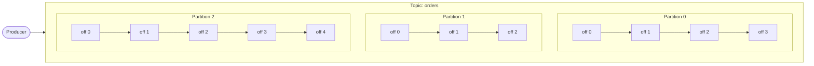
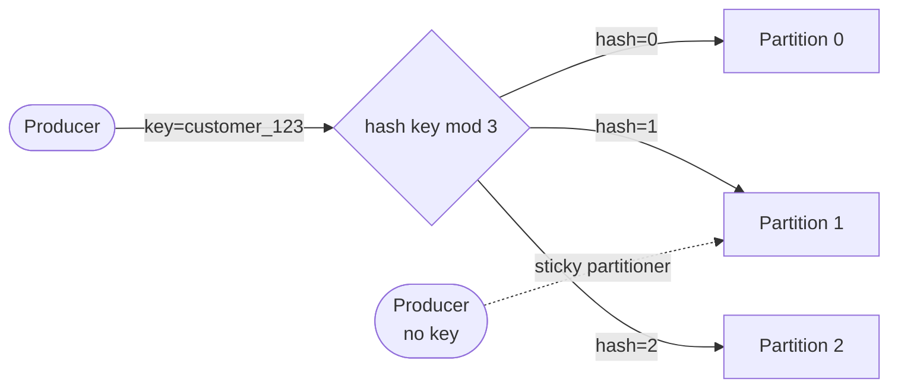
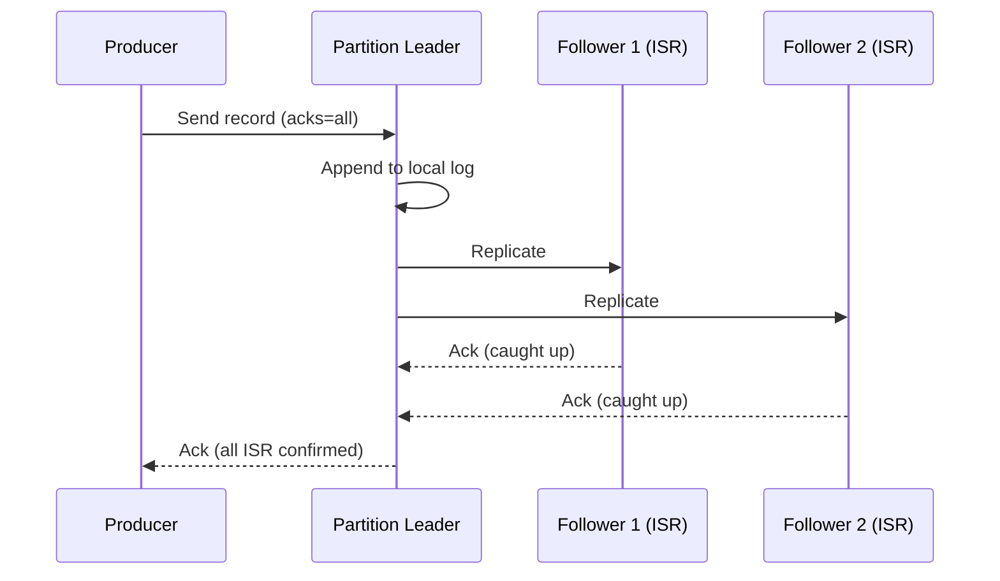
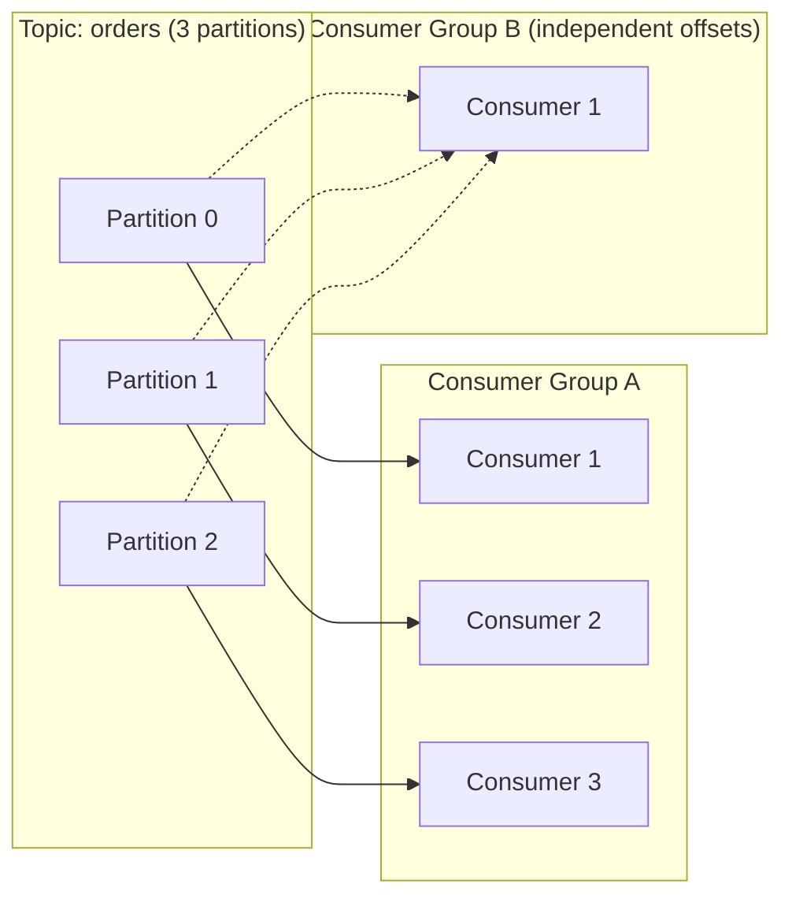
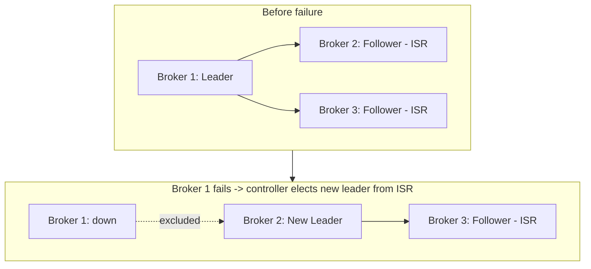

## 1. Fundamentals

**Q1. What is Kafka, and how does it differ from a traditional message queue?**
Kafka is a distributed event streaming platform built around a **commit log** abstraction. Producers append events to **topics**, split into **partitions** for parallelism and ordering (ordering guaranteed only within a partition).

Key difference from RabbitMQ/ActiveMQ: **consumption model**. Traditional queues remove a message once acknowledged — one consumer, one delivery. Kafka retains messages for a configurable retention period regardless of consumption, and consumers track their **own offsets**. This allows multiple independent consumer groups to replay, reprocess, or consume at different speeds — none of which is natural in a queue. Kafka trades flexible routing (exchanges/bindings) for raw throughput and durability at scale.

**Q2. What are topics, partitions, and offsets?**
- **Topic**: logical category/stream of events.
- **Partition**: an ordered, immutable, append-only log; a topic is split into N partitions for parallelism. Order is guaranteed only within a partition.
- **Offset**: a monotonically increasing ID for each record within a partition; consumers track their position via offsets.

**Q3. What is a broker, and what is a Kafka cluster?**
A broker is a single Kafka server that stores data and serves client requests. A cluster is a group of brokers working together; each broker hosts a subset of partitions (as leader or follower). One broker acts as **controller**, managing partition leadership and cluster metadata (via Raft/KRaft in modern Kafka, or ZooKeeper historically).

**Q4. KRaft vs ZooKeeper — what changed and why?**
Kafka historically depended on ZooKeeper for metadata, controller election, and ACLs. **KRaft** (Kafka Raft), GA since Kafka 3.3+ and default in newer versions, removes the ZooKeeper dependency — metadata is stored in Kafka itself as an event log, replicated via the Raft consensus protocol among a small quorum of controller nodes. Benefits: simpler ops (one system instead of two), faster controller failover, and support for far more partitions per cluster (ZooKeeper struggled beyond ~200K partitions).

---

## 2. Producer

**Q5. How does Kafka decide which partition a message goes to?**
- **With a key**: `hash(key) % numPartitions` (default partitioner uses murmur2) — deterministic, so all messages with the same key land in the same partition, preserving per-key order.
- **Without a key**: since Kafka 2.4+, the **sticky partitioner** batches records onto one partition at a time before switching (better batching/throughput) rather than strict round-robin.

**Q6. What does the `acks` setting control? Tradeoffs?**
Durability vs. throughput/latency knob:
- `acks=0`: fire-and-forget, no wait, no durability guarantee — fastest, riskiest.
- `acks=1`: waits for the **partition leader** to write locally. Risk: if leader crashes before replication, message is lost even though producer thinks it succeeded.
- `acks=all` (`-1`): waits for leader + all **in-sync replicas (ISR)** to ack. Strongest durability. Only meaningful combined with `min.insync.replicas >= 2` and `replication.factor >= 3` — otherwise `acks=all` can degrade to behaving like `acks=1`.

Typical answer: use `acks=all` + `min.insync.replicas=2` for critical data (financial events); `acks=1`/`0` for loss-tolerant, high-volume data (metrics/clickstream).

**Q7. What is idempotent production, and how does it prevent duplicates?**
Setting `enable.idempotence=true` assigns each producer a **Producer ID (PID)** and a per-partition **sequence number** to every message. The broker deduplicates based on (PID, sequence number), rejecting retries that would otherwise create duplicates from network retries under `acks=all`. This gives **exactly-once delivery per partition, per producer session**, not full end-to-end exactly-once by itself.

**Q8. What are Kafka Transactions, and how do they enable exactly-once semantics (EOS)?**
Transactions let a producer write to **multiple partitions atomically**, and coordinate with consumer offset commits — critical for "read-process-write" patterns (e.g., Kafka Streams). A **transaction coordinator** (broker) tracks transaction state; messages are tagged with a transactional ID and only become visible to consumers with `isolation.level=read_committed` once the transaction commits. Combined with idempotent producers, this delivers **exactly-once semantics** across a consume-transform-produce pipeline, not just at-least-once.

**Q9. Batching and compression — how do they affect throughput?**
Producers batch records per partition (`batch.size`, `linger.ms`) before sending, trading a small added latency for far fewer network round trips. Compression (`compression.type=lz4/snappy/zstd/gzip`) is applied to the whole batch, reducing network and disk I/O at the cost of CPU. `linger.ms` slightly delays sends to allow batches to fill — a key throughput lever in high-volume pipelines.

---

## 3. Consumer

**Q10. What is a consumer group, and how are partitions assigned?**
A consumer group is a set of consumers cooperating to consume one or more topics, where **each partition is assigned to exactly one consumer within the group** — giving parallelism without duplicate processing. Different consumer groups are fully independent, each tracking its own offsets, enabling pub/sub-style fan-out to multiple applications reading the same topic.

If partitions > consumers, some consumers get multiple partitions. If consumers > partitions, extra consumers sit **idle** — partition count is the hard upper bound on parallelism within a group.

**Q11. What happens during a rebalance, and what are the strategies?**
A rebalance reassigns partitions among group members — triggered when a consumer joins/leaves/crashes, or partition count changes. Coordinated by a **group coordinator** broker.
- **Eager (stop-the-world)**: all consumers revoke all partitions, then reassignment happens — causes a pause across the whole group.
- **Cooperative/incremental rebalancing** (`CooperativeStickyAssignor`): only the specific partitions that need to move are revoked/reassigned; other consumers keep processing uninterrupted. Preferred in modern deployments to minimize downtime.

**Q12. How does offset management work — auto-commit vs manual commit?**
Consumers commit offsets to an internal topic `__consumer_offsets`. `enable.auto.commit=true` commits periodically in the background — simple, but risks **at-least-once with duplicate reprocessing** (crash after processing, before commit) or, less commonly, message loss if committed before processing completes. Manual commit (`commitSync`/`commitAsync`) after successful processing gives control to align commit with actual work done — standard for correctness-sensitive pipelines.

**Q13. Explain consumer lag and how you'd monitor/alert on it.**
Lag = difference between the latest offset produced and the consumer's committed offset — indicates how far behind a consumer is. Monitored via tools like Burrow, Kafka's own `kafka-consumer-groups.sh`, or metrics exported to Prometheus/Grafana. Sustained/growing lag signals the consumer can't keep up (slow processing, undersized consumer group, downstream bottleneck, or a stuck consumer) — usually alerted on rate-of-growth, not just absolute value, since lag naturally spikes during traffic bursts.

**Q14. `read_committed` vs `read_uncommitted` isolation levels?**
`read_uncommitted` (default): consumer sees all messages, including those from transactions later aborted. `read_committed`: consumer only sees messages from committed transactions, skipping aborted/in-flight transactional messages — required for exactly-once pipelines.

---

## 4. Replication & Durability

**Q15. Explain leader/follower replication and ISR.**
Each partition has one **leader** (handles all reads/writes) and N-1 **followers** that replicate the leader's log. The **In-Sync Replica (ISR)** set is the subset of replicas fully caught up with the leader within `replica.lag.time.max.ms`. Only ISR members are eligible for leader election, ensuring no committed data is lost on failover.

**Q16. What happens when a broker holding a partition leader fails?**
The controller detects the failure (via session timeout) and elects a new leader from the **ISR** for each partition that broker led. If `unclean.leader.election.enable=false` (recommended default), only ISR members can become leader — preventing data loss, at the cost of unavailability if the entire ISR is down. If set `true`, an out-of-sync replica can become leader, trading durability for availability.

**Q17. What is `min.insync.replicas` and how does it interact with `acks`?**
It sets the minimum ISR size required for a write to succeed when `acks=all`. E.g., `replication.factor=3`, `min.insync.replicas=2` means writes succeed as long as 2 of 3 replicas (including leader) are in sync — tolerating one broker failure without blocking writes, while still guaranteeing durability across a failure.

**Q18. How does Kafka guarantee ordering, and what breaks it?**
Ordering is guaranteed only **within a partition**, not across a topic. It breaks when: messages for a logical entity are spread across partitions (no/rotating key), retries are enabled without idempotence (`max.in.flight.requests.per.connection > 1` can reorder retried batches), or a consumer processes partitions from multiple threads without care. Fix: key by entity ID, enable idempotent producer, keep `max.in.flight.requests.per.connection<=5` with idempotence on (Kafka guarantees order even with pipelining when idempotence is enabled).

---

## 5. Storage & Performance

**Q19. Why is Kafka fast? (sequential I/O, zero-copy, page cache)**
- **Sequential disk writes**: append-only log avoids random I/O seeks.
- **OS page cache**: Kafka relies on the OS page cache rather than JVM heap for read/write buffering — avoids GC pressure and duplicate caching.
- **Zero-copy transfer** (`sendfile` syscall): data goes from page cache directly to the network socket without copying into user space — huge win for consumer fan-out.
- **Batching + compression** at the producer reduces per-message overhead.

**Q20. What is log compaction, and when would you use it?**
An alternative retention policy (`cleanup.policy=compact`) that retains only the **latest value per key**, deleting older records with the same key (tombstones via `null` value fully remove a key). Used for state-like data — e.g., a topic backing a KTable, or a "latest known state" feed (like current price per stock, or a changelog for a service's local cache) — where you care about current state, not full history.

**Q21. Retention: time-based vs size-based, and how do they interact with compaction?**
`retention.ms` / `retention.bytes` control standard deletion of old segments. These can be combined with `compact` (`cleanup.policy=compact,delete`) — compaction removes superseded keys while retention still expires very old data outright. Useful for changelog topics that also need a hard cap on size/age.

---

## 6. Kafka Streams / ksqlDB (if relevant to the role)

**Q22. KStream vs KTable — what's the conceptual difference?**
`KStream` is a record stream — every event is an independent fact (e.g., "user clicked"). `KTable` is a changelog / table abstraction — each record represents an **update to a key's latest value** (e.g., "user's current status"), backed by a compacted topic. Joins between them (stream-table join) are common for enrichment (e.g., enrich a click event with the user's current profile).

**Q23. How does Kafka Streams achieve fault tolerance for local state?**
Local state stores (RocksDB-backed) are backed by a **changelog topic** (compacted) that Kafka Streams writes to as state changes. On failure/restart, the state store is rebuilt by replaying the changelog topic — no external DB dependency needed.

---

## 7. Operations, Failure Scenarios & System Design

**Q24. How would you design a topic for a high-throughput, ordered-per-entity use case (e.g., order events per customer)?**
Key by `customer_id` (or `order_id` if per-order ordering suffices) so all events for that entity land in one partition, preserving order. Choose partition count based on target throughput and expected max consumer parallelism (partitions = upper bound on consumer group parallelism) — but avoid over-partitioning since it increases open file handles, replication overhead, and end-to-end latency for controller operations. Use `acks=all` + `min.insync.replicas=2`, replication factor 3, idempotent producer, and monitor for **partition skew** (hot keys causing one partition to dominate).

**Q25. How do you handle a "poison pill" message that repeatedly crashes a consumer?**
Options: (1) wrap processing in try/catch and route failures to a **dead-letter topic (DLT)** rather than blocking the partition; (2) skip-and-log with alerting after N retries; (3) validate/schema-check at the producer side (e.g., via Schema Registry) to prevent bad data from entering the topic at all. Never let a single bad message stall an entire partition indefinitely in a production pipeline.

**Q26. What's the role of a Schema Registry, and why use Avro/Protobuf over raw JSON?**
Schema Registry enforces and versions a schema contract between producers and consumers (compatibility modes: backward, forward, full), preventing a producer's schema change from silently breaking consumers. Avro/Protobuf are compact binary formats with strong typing — smaller payloads, faster (de)serialization, and safer evolution than raw JSON, which has no built-in contract enforcement.

**Q27. How would you migrate/scale a topic's partition count in production? What breaks?**
Increasing partitions is supported (`kafka-topics.sh --alter`) but **does not retroactively repartition existing data**, and it **breaks key-based ordering guarantees** for existing keys, since the hash-to-partition mapping changes for all future messages once partition count changes. For a truly safe migration, teams typically create a new topic with the target partition count and migrate producers/consumers in a controlled cutover, rather than altering partition count live on a topic with strict ordering requirements.

**Q28. Multi-datacenter / disaster recovery — how does Kafka handle cross-cluster replication?**
Via **MirrorMaker 2** (or Confluent Replicator), which replicates topics across clusters/regions, preserving offsets via offset translation. Common patterns: active-passive (DR failover) or active-active (with careful handling of ID collisions/ordering across regions). Cross-cluster replication is asynchronous, so there's a **non-zero RPO** (recovery point objective) — a factor to call out explicitly in a system design answer.

**Q29. How do you monitor Kafka health in production? Key metrics.**
- **Broker**: under-replicated partitions (URP), active controller count, request latency (produce/fetch), disk usage, ISR shrink/expand rate.
- **Producer**: request latency, record error rate, batch size/compression ratio.
- **Consumer**: consumer lag (per group/partition), rebalance frequency/duration.
- **Cluster**: leader election rate (frequent elections signal instability).
Tools: Kafka's JMX metrics → Prometheus/Grafana, Confluent Control Center, Burrow for lag.

**Q30. Security — how do you secure a Kafka cluster?**
- **Encryption in transit**: TLS/SSL between clients and brokers, and inter-broker.
- **Authentication**: SASL (SCRAM, GSSAPI/Kerberos, OAUTHBEARER) or mTLS.
- **Authorization**: ACLs per topic/consumer group/operation, or integration with a centralized RBAC system.
- **Encryption at rest**: typically handled at the disk/volume layer (e.g., EBS encryption), not natively by Kafka.

---

## 8. Rapid-fire / Comparison Questions

**Q31. Kafka vs RabbitMQ — full answer?**
Kafka is a persistent, replayable log optimized for high-throughput streaming and multi-consumer fan-out; RabbitMQ is a broker optimized for flexible routing (exchanges, bindings, priority/delay queues) and low-latency task distribution where a message is consumed once and gone. Choose Kafka for event sourcing/stream processing/audit trails; choose RabbitMQ for complex routing topologies or classic task-queue workloads.

**Q32. Kafka vs Kinesis — full answer?**
Kafka is self-managed (or via Confluent/MSK), highly configurable, with a large ecosystem (Streams, Connect, ksqlDB) but more operational overhead. Kinesis is fully managed AWS-native, simpler to operate, scales via **shards** (conceptually similar to partitions) with tighter AWS IAM/service integration, but less flexible tuning and a smaller ecosystem than Kafka's.

**Q33. What happens when consumers outnumber partitions?**
Each partition is owned by exactly one consumer within a group, so once every partition has an assigned consumer, any additional consumers in that group sit **idle** — partition count is the hard ceiling on consumption parallelism per group. Fix by increasing partitions (with the caveats in Q27) or reconsidering the parallelism model.

**Q34. At-least-once vs exactly-once vs at-most-once — full answer?**
- **At-most-once**: commit offset before processing — a crash mid-processing loses the message (rare in practice, usually a misconfiguration).
- **At-least-once**: process then commit offset — a crash after processing but before commit causes reprocessing/duplicates. This is the common default.
- **Exactly-once**: achieved via idempotent producer (dedupes retries) + transactions (atomic write across partitions and offset commits) — standard for Kafka Streams' `processing.guarantee=exactly_once_v2`. True end-to-end EOS also requires the downstream sink to be transactional or idempotent itself.

**Q35. Why avoid over-partitioning a cluster?**
Every partition costs an open file handle per replica, adds replication traffic, and increases the time for controller operations like leader election and failover (more partitions to reassign). Very high partition counts can also increase end-to-end latency and memory pressure on brokers. Right-size partitions for target throughput and expected consumer parallelism, not "as many as possible."

**Q36. What causes under-replicated partitions (URPs), and how do you respond?**
A follower falls behind the leader beyond `replica.lag.time.max.ms`, usually from broker overload (CPU/disk I/O saturation), network issues, or a broker restart still catching up. Response: check broker resource metrics, disk I/O wait, network throughput, and GC pauses; sustained URPs risk reduced durability (smaller ISR) and should page on-call before they turn into an outage.

---

## How to Use This for Lead-Level Prep
1. Cover each answer **out loud**, explaining the "why," not just reciting definitions.
2. For System Design rounds, be ready to combine Q24, Q27, Q28, Q29 into one cohesive design narrative (topic design → durability config → scaling → DR → monitoring).
3. Be ready to connect concepts to your own Fidelity Offers Platform experience (e.g., ordering guarantees for offer eligibility events, `acks=all` for financial-adjacent data, DLT design for malformed offer events).
