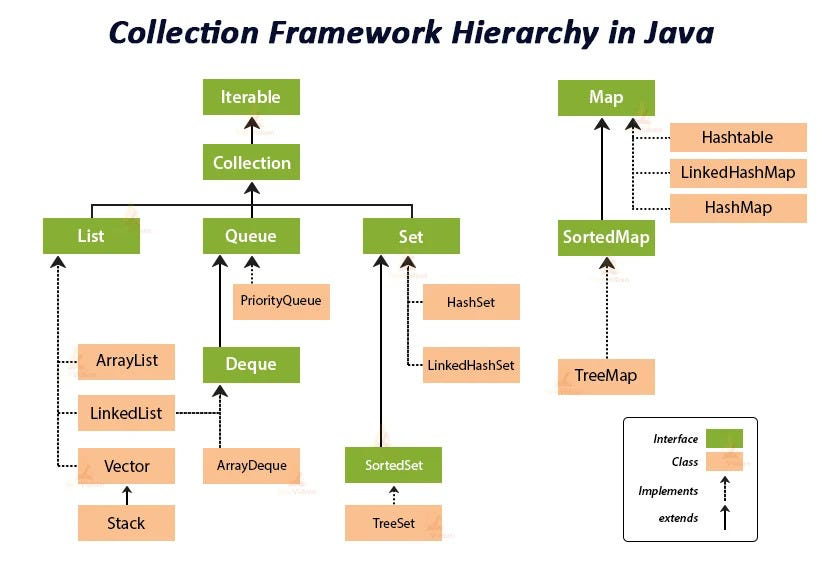

## MAP internal working
In Java 8, HashMap works internally by using an array of buckets, where each bucket can hold a Node or a TreeNode.
1. Hashing and Bucket Calculation:
   When a key-value pair is inserted, the hashCode() method of the key is called to get a hash value.
   This hash value is then used to determine the index of the bucket in the internal array where the entry will be stored.
2. Handling Collisions:
   If multiple keys hash to the same bucket (a collision), HashMap uses separate chaining to handle them.
   Before Java 8: Collisions were resolved by storing colliding entries in a linked list at that bucket index. Each Node in the linked list contains the hash, key, value, and a next pointer to the subsequent node.
   Java 8 Enhancement: To improve performance in cases of frequent collisions, Java 8 introduced a crucial optimization. If the number of nodes in a single bucket's linked list exceeds a certain TREEIFY_THRESHOLD (defaulting to 8), that linked list is converted into a balanced Red-Black Tree (represented by TreeNodes). This conversion improves lookup time from O(n) in the worst-case (for a long linked list) to O(log n) in the worst-case (for a balanced tree).
3. Retrieving Values:
   To retrieve a value, the key's hashCode() is calculated to find the correct bucket.
   The equals() method is then used to compare the provided key with the keys of the nodes within that bucket's linked list or tree structure until a match is found.
4. Resizing:
   HashMap has a load factor (defaulting to 0.75) and a capacity(16). When the number of entries exceeds capacity * load_factor, the HashMap is resized.
   Resizing involves creating a new, larger internal array (typically doubling the capacity) and re-hashing all existing entries to their new positions in the larger array. This can be a performance-intensive operation.

| Map Type              | Ordered?          | Null Keys | Null Values | Thread-safe | Avg. Time | Use Case                     |
| --------------------- | ----------------- | --------- | ----------- | ----------- | --------- | ---------------------------- |
| **HashMap**           | ❌ No              | ✅ 1       | ✅ Yes       | ❌ No        | O(1)      | General-purpose, fast lookup |
| **LinkedHashMap**     | ✅ Insertion order | ✅ 1       | ✅ Yes       | ❌ No        | O(1)      | Predictable iteration order  |
| **TreeMap**           | ✅ Sorted order    | ❌ No      | ✅ Yes       | ❌ No        | O(log n)  | Sorted keys / range queries  |
| **Hashtable**         | ❌ No              | ❌ No      | ❌ No        | ✅ Yes       | O(1)      | Legacy thread-safe map       |
| **ConcurrentHashMap** | ❌ No              | ❌ No      | ❌ No        | ✅ Yes       | O(1)      | Modern thread-safe map       |
| **EnumMap**           | ✅ Enum order      | ❌ No      | ✅ Yes       | ❌ No        | O(1)      | Map keys are enums           |
| **IdentityHashMap**   | ❌ No              | ✅ 1       | ✅ Yes       | ❌ No        | O(1)      | Compare keys by reference    |

## LIST
| Implementation           | Internal DS       | Ordering | Duplicates | Nulls | Thread-Safe | Random Access | Insert/Delete Middle |
| ------------------------ | ----------------- | -------- | ---------- | ----- | ----------- | ------------- | -------------------- |
| **ArrayList**            | Dynamic Array     | ✅ Yes    | ✅ Yes      | ✅ Yes | ❌ No        | ✅ O(1)        | ❌ O(n)               |
| **LinkedList**           | Doubly LinkedList | ✅ Yes    | ✅ Yes      | ✅ Yes | ❌ No        | ❌ O(n)        | ✅ O(1)               |
| **Vector**               | Dynamic Array     | ✅ Yes    | ✅ Yes      | ✅ Yes | ✅ Yes       | ✅ O(1)        | ❌ O(n)               |
| **Stack**                | Vector-based      | ✅ Yes    | ✅ Yes      | ✅ Yes | ✅ Yes       | ✅ O(1)        | ❌ O(n)               |
| **CopyOnWriteArrayList** | Dynamic Array     | ✅ Yes    | ✅ Yes      | ✅ Yes | ✅ Yes       | ✅ O(1)        | ❌ O(n)               |
