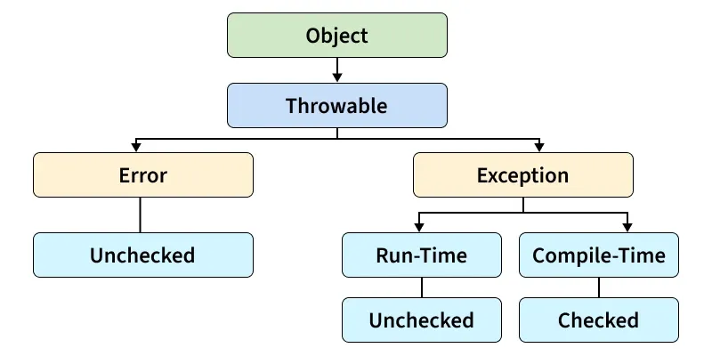
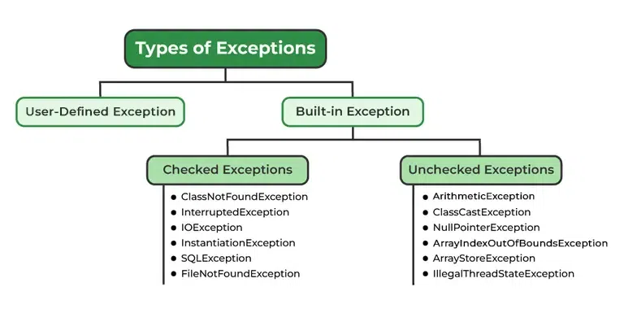

# Content
[Overview](#Overview) | [Exception Hierarchy](Exception-Hierarchy) | [Types of Java Exceptions](#Types-of-Exceptions)


## Overview
Exception handling in Java is a powerful mechanism that allows developers to manage runtime errors, ensuring the normal flow of the application. It involves the use of keywords such as `try`, `catch`, `finally`, `throw`, and `throws`.  
## Exception-Hierarchy


## Types-of-Exceptions
Java exceptions can be broadly categorized into three types:
1. **Checked Exceptions**: These are exceptions that are checked at compile-time. The compiler forces the programmer to handle these exceptions using `try-catch` blocks or by declaring them in the method signature with the `throws` keyword. Examples include `IOException`, `SQLException`, etc.
```java
public void readFile() throws IOException {
    FileReader reader = new FileReader("data.txt"); // IOException is checked
}
```
3. **Unchecked Exceptions**: These exceptions are not checked at compile-time but at runtime. They are subclasses of `RuntimeException` and include exceptions like `NullPointerException`, `ArrayIndexOutOfBoundsException`, etc. Programmers are not required to handle these exceptions explicitly.
```java
public int divide(int a, int b) {
    return a / b; // May throw ArithmeticException
}
```
5. **Errors**: Errors are serious issues that are not meant to be caught by applications. They are subclasses of the `Error` class and indicate problems that are typically outside the control of the application, such as `OutOfMemoryError`, `StackOverflowError`, etc.
```java
public void recursiveCall() {
    recursiveCall(); // May cause StackOverflowError
}
```

| Aspect                | **Checked Exception**                  | **Unchecked Exception**                     | **Error**                                   |
|----------------------|----------------------------------------|--------------------------------------------|--------------------------------------------|
| **Compile-time check** | Yes                                   | No                                         | No                                         |
| **Recoverable?**     | Yes (should handle gracefully)         | Sometimes (fix logic issues)              | No (system-level failure)                 |
| **Must declare in method signature?** | Yes (`throws`)                      | No                                         | No                                         |
| **Examples**         | `IOException`, `SQLException`          | `NullPointerException`, `ArithmeticException` | `OutOfMemoryError`, `StackOverflowError`  |
| **Purpose**          | Anticipated external issues            | Programming errors                         | JVM/system failures                        |




## Key Concepts
1. **Try Block**: The code that might throw an exception is placed inside a `try` block.  
   ```java
   try {
       // Code that may throw an exception
   }
   ```
2. **Catch Block**: The `catch` block is used to handle the exception thrown by the `try` block. You can have multiple `catch` blocks to handle different types of exceptions.  
   ```java
   catch (ExceptionType1 e1) {
       // Handle ExceptionType1
   } catch (ExceptionType2 e2) {
       // Handle ExceptionType2
   }
   ```
3. **Finally Block**: The `finally` block is optional and is used to execute code that must run regardless of whether an exception occurred or not, such as closing resources.  
   ```java
   finally {
       // Code that will always execute
   }
   ```
4. **Throw Statement**: The `throw` statement is used to explicitly throw an exception.  
   ```java
    throw new ExceptionType("Error message");
    ```
5. **Throws Clause**: The `throws` clause is used in method declarations to indicate that a method can throw certain types of exceptions.
    ```java
    public void methodName() throws ExceptionType1, ExceptionType2 {
         // Method implementation
    }
    ```
## Example
```java
public class ExceptionHandlingExample {
    public static void main(String[] args) {
        try {
            int result = divide(10, 0);
            System.out.println("Result: " + result);
        } catch (ArithmeticException e) {
            System.out.println("Error: Division by zero is not allowed.");
        } finally {
            System.out.println("Execution completed.");
        }
    }

    public static int divide(int a, int b) throws ArithmeticException {
        if (b == 0) {
            throw new ArithmeticException("Division by zero");
        }
        return a / b;
    }
}
```
In this example, the `divide` method throws an `ArithmeticException` if an attempt is made to divide by zero. The `main` method handles this exception using a `try-catch` block and ensures that the `finally` block executes regardless of whether an exception occurred.  
## Best Practices
- Always catch the most specific exceptions first.
- Use the `finally` block to release resources like file handles or database connections.
- Avoid using exceptions for control flow.
- Document the exceptions your methods can throw using the `throws` clause.
- Log exceptions to help with debugging and maintenance.
- Consider using custom exceptions for application-specific error handling.
- Test exception handling code thoroughly to ensure robustness.
- Avoid empty catch blocks; always handle exceptions appropriately.
- Use try-with-resources for automatic resource management when dealing with `AutoCloseable` resources.
- Be cautious with checked exceptions; use them judiciously to avoid cluttering method signatures.
- Provide meaningful error messages when throwing exceptions to aid in debugging.

## Exception in inheritance
When dealing with inheritance, it's important to understand how exceptions are handled in overridden methods. A subclass method can only throw the same exceptions or subclasses of the exceptions declared in the superclass method.  
```java
class SuperClass {
    public void display() throws IOException {
        // Method implementation
    }
}
class SubClass extends SuperClass {
    @Override
    public void display() throws FileNotFoundException {
        // Method implementation
    }
} 
```
In this example, the `SubClass` overrides the `display` method from `SuperClass` and is allowed to throw `FileNotFoundException`, which is a subclass of `IOException`. However, it cannot throw a broader exception than what is declared in the superclass method.

