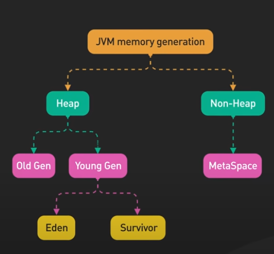
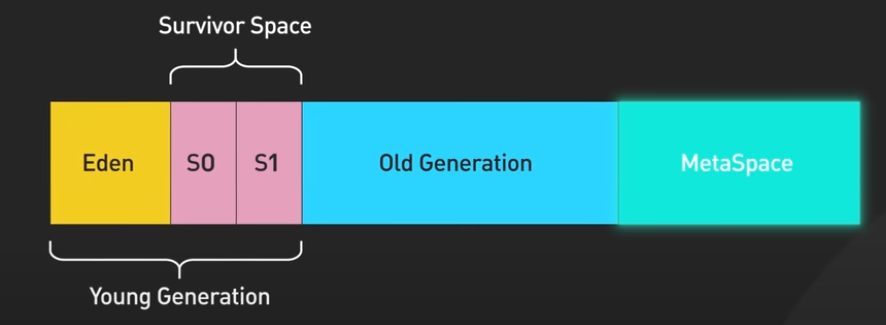

## Types of Memory
1. Stack
    - Temporary variable and separate memory block for methods
    - Primitive data types
    - Reference of heap objects
      - Strong
        ```java
        Person person = new Person() //GC Do not delete
        ```
      - Weak
        ```java
        WeakReference<Person> wk = new WeakReference<>(new Person())//GC will delete
        ```
      - Soft
        ```java
        SoftReference<Person> wk = new SoftReference<>(new Person())//GC allowed to delete if space is relly needed
        ```
    - Each Thread has its own stack memory
    - As soon as variable goes out of scope its deleted from stack
    - If stack is full StackOverFlow error
      

   
2. Heap

    
   - Object will be added to eden
   - GC invoked 
     - Mark => object without reference will be marked for delete
     - Sweep => the one marked for delete will be deleted and the one with reference will be added with age and moved to S0 
     - The above 2 step is called MINOR GC
     - Next time same step of mark and sweep but during sweep it will delete and add age and move to s1 i.e. at any point either s0 or s1 will be empty and eden will be empty
     - let's say age is reached to threshold it will be promoted to old generation
     - In old gen it is called MAJOR GC and run les frequently
3. Meta Space
    - Class variable (static)
    - Class meta data
    - Constants (static final)

NOTE: earlier meta was "permanent generation"
    - it was part of heap
    - not expandable

4. Different GC algo
    - Mark and Sweep
    - Mark and sweep with compaction
5. Diffrent version of GC
    - Serial GC - only one GC thread will work.
    - Parallel GC - multiple thread of GC
    - Concurrent mark and sweep :
      - GC thread will work in parallel to app thread 
      - Not 100% guaranteed  
      - No compaction
    - G1 :
      - GC thread will work in parallel to app thread 
      - 100% guaranteed
      - With compaction
