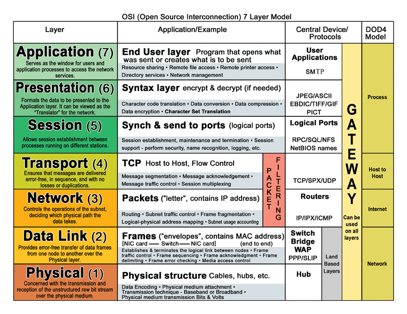
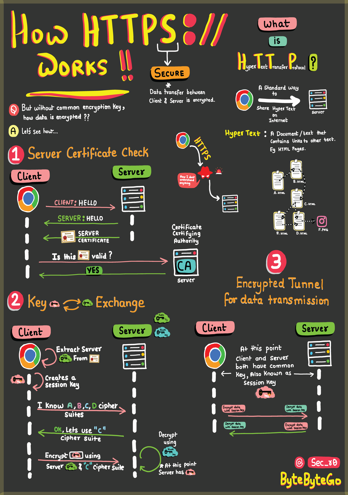
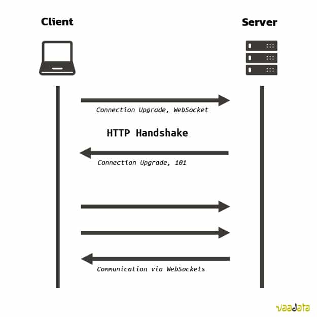

# Content
[OSI](#OSI) | [How TCP works](TCP) | [UDP](#UDP) | [HTTP](#HTTP) | [HTTPS](#HTTPS) | 
[GraphQl](#GraphQl) | [GRPC](#GRPC) | [SSE](#SSE) | [WebSocket](#WebSocket) | 
[WebRTC](#WebRTC) | [Layer 4 Load Balancer](#Layer-4-Load-Balancer) | 
[Layer 7 Load Balancer](#Layer-7-Load-Balancer) | [Retries Backoff Jitter](#Retries-Backoff-Jitter) | 

## OSI
- Open Systems Interconnection model
- 7 layers:

## TCP
- Transmission Control Protocol - Layer 4 (Transport Layer)
  - Connection-oriented protocol
  - Reliable data transfer
  - Guaranteed delivery
  - Ordered data transfer
  - Congestion control
  - Flow control
  - Error detection and correction
- TCP Handshake
  - Three-way handshake
    - SYN
    - SYN-ACK
    - ACK
    
     

## UDP
- User Datagram Protocol - Layer 4 (Transport Layer)
  - Connectionless protocol
  - Unreliable data transfer
  - No guaranteed delivery
  - No ordered data transfer
  - No congestion control
  - No flow control
  - Error detection (optional)
- Use Cases
  - Streaming media
  - Online gaming
  - VoIP
  - DNS queries
  - Broadcast and multicast communications
## HTTP
- Hypertext Transfer Protocol - Layer 7 (Application Layer)
  - Stateless protocol
  - Request-response model
  - Methods: GET, POST, PUT, DELETE, PATCH, HEAD, OPTIONS
  - Status codes: 1xx, 2xx, 3xx, 4xx, 5xx
  - Headers: Metadata about the request/response
  - Body: Actual data being transferred
- HTTP/1.1 vs HTTP/2 vs HTTP/3
  - HTTP/1.1: Text-based, supports persistent connections, pipelining
  - HTTP/2: Binary protocol, multiplexing, header compression, server push
  - HTTP/3: Based on QUIC, improved performance, reduced latency, built-in encryption
## HTTPS
- Hypertext Transfer Protocol Secure - Layer 7 (Application Layer)
  - Secure version of HTTP
  - Uses SSL/TLS for encryption
  - Ensures data integrity, confidentiality, and authentication
  - Uses certificates for authentication
  - Default port: 443
  
- SSL vs TLS
  - SSL (Secure Sockets Layer): Older protocol, now deprecated
  - TLS (Transport Layer Security): Successor to SSL, more secure, widely used
## GraphQl
- GraphQL - Layer 7 (Application Layer)
  - Query language for APIs
  - Allows clients to request only the data they need
  - Single endpoint for all queries and mutations
  - Strongly typed schema
  - Real-time data with subscriptions
- Advantages
  - Reduced over-fetching and under-fetching of data
  - Improved performance for complex queries
  - Easier to evolve APIs
  - Better developer experience
- Disadvantages
  - More complex server implementation
  - Caching can be more challenging
  - Potential for more complex queries leading to performance issues
## GRPC
- gRPC - Layer 7 (Application Layer)
  - Remote Procedure Call (RPC) framework
  - Uses HTTP/2 for transport
  - Uses Protocol Buffers (protobuf) for serialization
  - Supports multiple programming languages
  - Bi-directional streaming
- Advantages
  - High performance and low latency
  - Strongly typed contracts with protobuf
  - Built-in support for authentication, load balancing, and retries
  - Efficient for microservices communication
- Disadvantages
  - Steeper learning curve
  - Less human-readable than REST/JSON
  - Requires more setup and tooling
  - Limited browser support (requires gRPC-Web for browser clients)
## SSE
- Server-Sent Events (SSE) - Layer 7 (Application Layer)
  - Unidirectional communication from server to client
  - Built on top of HTTP
  - Uses EventSource API in browsers
  - Text-based format (usually UTF-8)
  - Automatic reconnection and event ID tracking
- Advantages
  - Simple to implement
  - Lightweight and efficient for real-time updates
  - Built-in support in modern browsers
  - Works well for scenarios like live feeds, notifications, and real-time updates
- Disadvantages
  - Unidirectional (server to client only)
  - Limited support in older browsers
  - Not suitable for high-frequency updates (compared to WebSockets)
  - No binary data support (text only)
## WebSocket
- WebSocket - Layer 7 (Application Layer)
  - Full-duplex communication channel over a single TCP connection
  - Bi-directional communication between client and server
  - Uses a handshake to establish the connection (upgrades from HTTP)
  - Message-based protocol (text and binary)
  - Low latency and real-time communication
- Advantages
  - Real-time, low-latency communication
  - Bi-directional communication
  - Efficient for high-frequency updates
  - Supports both text and binary data
- Disadvantages
  - More complex to implement than HTTP/SSE
  - Requires a persistent connection (may not work well with some proxies/firewalls)
  - Less support in older browsers
  - Potentially higher resource usage on the server due to persistent connections
  - Security considerations (e.g., cross-site WebSocket hijacking)
  
## WebRTC
- WebRTC (Web Real-Time Communication) - Layer 7 (Application Layer)
  - Peer-to-peer communication protocol
  - Supports audio, video, and data channels
  - Built-in NAT traversal using ICE, STUN, and TURN
  - Secure communication with DTLS and SRTP
  - Used for video conferencing, file sharing, and real-time gaming
- Advantages
  - Direct peer-to-peer communication
  - Low latency for real-time applications
  - Built-in support for audio and video
  - Secure by default
- Disadvantages
  - More complex to implement than traditional client-server models
  - Requires signaling server for connection setup
  - Browser compatibility issues
  - Limited support for large-scale broadcasting (requires SFU/MCU)
  - Potentially higher resource usage on client devices
## Layer 4 Load Balancer
- Layer 4 Load Balancer - Operates at the Transport Layer (OSI Layer 4)
  - Distributes traffic based on IP address and TCP/UDP ports
  - Works with any protocol (HTTP, HTTPS, FTP, etc.)
  - Uses algorithms like Round Robin, Least Connections, IP Hash
  - Faster and more efficient than Layer 7 load balancers
  - Commonly used for high-performance applications
- Advantages
  - High performance and low latency
  - Works with any protocol
  - Simple to configure and manage
  - Can handle large volumes of traffic
- Disadvantages
  - Limited visibility into application-level data
  - Cannot make decisions based on HTTP headers or content
  - Less flexible than Layer 7 load balancers
  - May require additional configuration for SSL termination
## Layer 7 Load Balancer
- Layer 7 Load Balancer - Operates at the Application Layer (OSI Layer 7)
  - Distributes traffic based on application-level data (HTTP headers, cookies, etc.)
  - Can make intelligent routing decisions based on content
  - Supports advanced features like SSL termination, URL rewriting, and session persistence
  - Commonly used for web applications and APIs
- Advantages
  - Intelligent routing based on application data
  - Supports advanced features like SSL termination and URL rewriting
  - Can improve application performance and reliability
  - Better visibility into application-level metrics
- Disadvantages
  - Higher latency compared to Layer 4 load balancers
  - More complex to configure and manage
  - May not support all protocols (primarily HTTP/HTTPS)
  - Potentially higher resource usage on the load balancer
  - Can become a single point of failure if not properly managed
## Retries Backoff Jitter
- Retries Backoff Jitter - Strategy for handling transient failures in network communication
  - Retries: Attempting to resend a failed request
  - Backoff: Increasing the wait time between retries to avoid overwhelming the server
  - Jitter: Adding randomness to the backoff time to prevent synchronized retries from multiple clients
- Common Backoff Strategies
  - Fixed Backoff: Constant wait time between retries
  - Exponential Backoff: Wait time increases exponentially with each retry
  - Exponential Backoff with Jitter: Combines exponential backoff with random jitter to spread out retries
- Advantages
  - Reduces the likelihood of overwhelming the server
  - Improves the chances of successful retries
  - Helps to avoid thundering herd problems
- Disadvantages
  - Increases overall latency for request completion
  - More complex to implement than simple retries
  - Requires careful tuning of backoff and jitter parameters to balance responsiveness and load on the server
  - May not be suitable for all types of applications (e.g., real-time applications)
  - Can lead to increased resource usage on the client side due to multiple retry attempts
  - Potentially complicates error handling logic in the application
  - May require monitoring and logging to track retry behavior and effectiveness
  - Can lead to longer wait times for users if not properly managed
