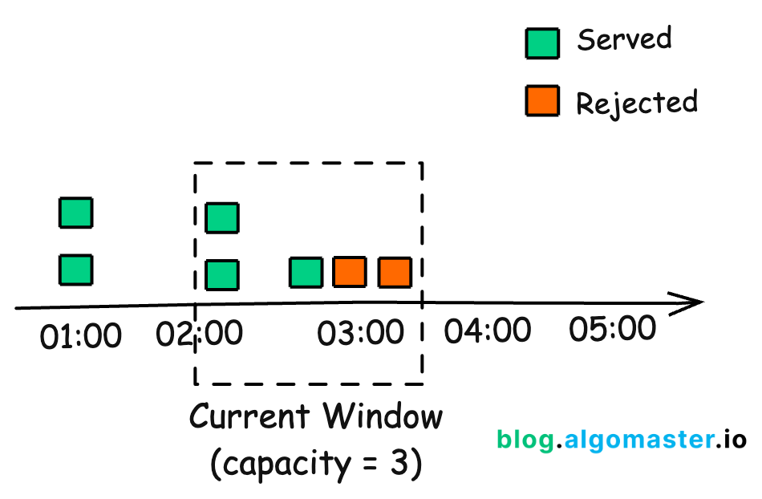

# Content

[Token Bucket Rate Limiter](#Token-Bucket) | [Leaky Bucket](#Leaky-Bucket) | [Fixed Window Counter](#Fixed-Window-Counter) | 
[Sliding Window Log](#Sliding-Window-Log) | [Sliding Window Counter](#Sliding-Window-Counter)

- HTTP 429 : "To Many Reuests"
- https://www.hellointerview.com/learn/system-design/problem-breakdowns/distributed-rate-limiter
- https://www.youtube.com/watch?v=MIJFyUPG4Z4
## Token Bucket
- Bucket with a fixed capacity
- Tokens are added to the bucket at a fixed rate
- Each request consumes a token
- If the bucket is empty, requests are denied
- Allows for bursts of traffic up to the bucket's capacity
- Commonly used in network traffic shaping and API rate limiting
- Example: Limiting API requests to 100 requests per minute with a burst capacity of 20 requests


```java
import java.util.concurrent.atomic.AtomicLong;

public class TokenBucket {
    private final long capacity;
    private final long refillRate; // tokens per second
    private AtomicLong tokens;
    private long lastRefillTimestamp;

    public TokenBucket(long capacity, long refillRate) {
        this.capacity = capacity;
        this.refillRate = refillRate;
        this.tokens = new AtomicLong(capacity);
        this.lastRefillTimestamp = System.nanoTime();
    }

    private synchronized void refill() {
        long now = System.nanoTime();
        long elapsedTime = now - lastRefillTimestamp;
        long tokensToAdd = (elapsedTime * refillRate) / 1_000_000_000;

        if (tokensToAdd > 0) {
            long newTokenCount = Math.min(capacity, tokens.get() + tokensToAdd);
            tokens.set(newTokenCount);
            lastRefillTimestamp = now;
        }
    }

    public synchronized boolean tryConsume() {
        refill();
        if (tokens.get() > 0) {
            tokens.decrementAndGet();
            return true;
        }
        return false;
    }
}
public class Main {
    public static void main(String[] args) throws InterruptedException {
        TokenBucket bucket = new TokenBucket(5, 1); // 5 tokens max, refill 1 token/sec

        for (int i = 0; i < 10; i++) {
            if (bucket.tryConsume()) {
                System.out.println("Request " + i + " allowed");
            } else {
                System.out.println("Request " + i + " denied");
            }
            Thread.sleep(500); // simulate time between requests
        }
    }
}
```
- Customizations 
  - You can adjust capacity and refillRate based on your API limits. 
  - For distributed systems, consider using Redis or other shared stores to manage buckets across nodes.
- Use Cases
  - API rate limiting
  - Network traffic shaping
  - Controlling access to shared resources
  - Throttling user actions in applications
  - Preventing abuse in online services
  - Managing load on backend services
  - Controlling data flow in streaming applications
## Leaky-Bucket
- Fixed-size bucket that leaks at a constant rate
- Incoming requests are added to the bucket
- If the bucket is full, incoming requests are denied
- Requests are processed at a steady rate, smoothing out bursts
- Commonly used in network traffic shaping and rate limiting
- Example: Limiting API requests to 100 requests per minute with a processing rate of 1 request per second


```java
import java.util.concurrent.atomic.AtomicInteger;
import java.util.concurrent.locks.ReentrantLock;
import java.util.Timer;
import java.util.TimerTask;
public class LeakyBucket {
    private final int capacity;
    private final int leakRate; // requests per second
    private AtomicInteger currentSize;
    private final ReentrantLock lock;

    public LeakyBucket(int capacity, int leakRate) {
        this.capacity = capacity;
        this.leakRate = leakRate;
        this.currentSize = new AtomicInteger(0);
        this.lock = new ReentrantLock();

        // Schedule a task to leak requests at a fixed rate
        Timer timer = new Timer(true);
        timer.scheduleAtFixedRate(new TimerTask() {
            @Override
            public void run() {
                leak();
            }
        }, 1000 / leakRate, 1000 / leakRate);
    }

    private void leak() {
        lock.lock();
        try {
            if (currentSize.get() > 0) {
                currentSize.decrementAndGet();
            }
        } finally {
            lock.unlock();
        }
    }

    public boolean tryConsume() {
        lock.lock();
        try {
            if (currentSize.get() < capacity) {
                currentSize.incrementAndGet();
                return true;
            }
            return false;
        } finally {
            lock.unlock();
        }
    }
}
public class Main {
    public static void main(String[] args) throws InterruptedException {
        LeakyBucket bucket = new LeakyBucket(5, 1); // capacity of 5, leak rate of 1 request/sec
        for (int i = 0; i < 10; i++) {
            if (bucket.tryConsume()) {
                System.out.println("Request " + i + " allowed");
            } else {
                System.out.println("Request " + i + " denied");
            }
            Thread.sleep(500); // simulate time between requests
        }
    }
}
```
- Customizations
  - Adjust capacity and leakRate based on your requirements.
  - For distributed systems, consider using a shared data store to maintain the bucket state across nodes
  
## Fixed Window Counter
- Divides time into fixed intervals (windows)
- Counts requests in each window
- If the count exceeds the limit, requests are denied
- Simple to implement but can lead to bursts at window boundaries
- Example: Limiting API requests to 100 requests per minute
- Commonly used in web applications and APIs


```java
import java.util.concurrent.atomic.AtomicInteger;
import java.util.concurrent.locks.ReentrantLock;
import java.time.Instant;
import java.time.Duration;
import java.util.Timer;
import java.util.TimerTask;
public class FixedWindowRateLimiter {
    private final int maxRequests;
    private final Duration windowSize;
    private AtomicInteger requestCount;
    private Instant windowStart;
    private final ReentrantLock lock;

    public FixedWindowRateLimiter(int maxRequests, Duration windowSize) {
        this.maxRequests = maxRequests;
        this.windowSize = windowSize;
        this.requestCount = new AtomicInteger(0);
        this.windowStart = Instant.now();
        this.lock = new ReentrantLock();

        // Schedule a task to reset the counter at the end of each window
        Timer timer = new Timer(true);
        timer.scheduleAtFixedRate(new TimerTask() {
            @Override
            public void run() {
                resetWindow();
            }
        }, windowSize.toMillis(), windowSize.toMillis());
    }

    private void resetWindow() {
        lock.lock();
        try {
            requestCount.set(0);
            windowStart = Instant.now();
        } finally {
            lock.unlock();
        }
    }

    public boolean tryConsume() {
        lock.lock();
        try {
            if (Duration.between(windowStart, Instant.now()).compareTo(windowSize) >= 0) {
                resetWindow();
            }
            if (requestCount.get() < maxRequests) {
                requestCount.incrementAndGet();
                return true;
            }
            return false;
        } finally {
            lock.unlock();
        }
    }
}
public class Main {
    public static void main(String[] args) throws InterruptedException {
        FixedWindowRateLimiter limiter = new FixedWindowRateLimiter(5, Duration.ofSeconds(10)); // 5 requests per 10 seconds
        for (int i = 0; i < 10; i++) {
            if (limiter.tryConsume()) {
                System.out.println("Request " + i + " allowed");
            } else {
                System.out.println("Request " + i + " denied");
            }
            Thread.sleep(1000); // simulate time between requests
        }
    }
}
```
- Customizations
  - Adjust maxRequests and windowSize based on your requirements.
  - For distributed systems, consider using a shared data store to maintain the request count across nodes.

## Sliding-Window-Log
- Maintains a log of timestamps for each request
- When a request is made, it removes timestamps older than the window size
- Counts the remaining timestamps to determine if the request can be allowed
- More accurate than fixed window but requires more memory
- Example: Limiting API requests to 100 requests per minute
- Commonly used in high-traffic applications and APIs


```java
import java.util.LinkedList;
import java.util.Queue;
import java.time.Instant;
import java.time.Duration;
import java.util.concurrent.locks.ReentrantLock;
public class SlidingWindowRateLimiter {
    private final int maxRequests;
    private final Duration windowSize;
    private final Queue<Instant> requestTimestamps;
    private final ReentrantLock lock;

    public SlidingWindowRateLimiter(int maxRequests, Duration windowSize) {
        this.maxRequests = maxRequests;
        this.windowSize = windowSize;
        this.requestTimestamps = new LinkedList<>();
        this.lock = new ReentrantLock();
    }

    public boolean tryConsume() {
        lock.lock();
        try {
            Instant now = Instant.now();
            // Remove timestamps outside the window
            while (!requestTimestamps.isEmpty() && Duration.between(requestTimestamps.peek(), now).compareTo(windowSize) > 0) {
                requestTimestamps.poll();
            }
            if (requestTimestamps.size() < maxRequests) {
                requestTimestamps.add(now);
                return true;
            }
            return false;
        } finally {
            lock.unlock();
        }
    }
}
public class Main {
    public static void main(String[] args) throws InterruptedException {
        SlidingWindowRateLimiter limiter = new SlidingWindowRateLimiter(5, Duration.ofSeconds(10)); // 5 requests per 10 seconds
        for (int i = 0; i < 10; i++) {
            if (limiter.tryConsume()) {
                System.out.println("Request " + i + " allowed");
            } else {
                System.out.println("Request " + i + " denied");
            }
            Thread.sleep(1000); // simulate time between requests
        }
    }
}
```
- Customizations
  - Adjust maxRequests and windowSize based on your requirements.
  - For distributed systems, consider using a shared data store to maintain the request log across nodes.

## Sliding-Window-Counter
- Divides time into smaller intervals (sub-windows)
- Maintains a count of requests in each sub-window
- When a request is made, it sums the counts of the relevant sub-windows to determine if the request can be allowed
- More memory efficient than sliding window log but less accurate
- Example: Limiting API requests to 100 requests per minute with 6 sub-windows
- Commonly used in web applications and APIs


```java
import java.util.concurrent.atomic.AtomicIntegerArray;
import java.util.concurrent.locks.ReentrantLock;
import java.time.Instant;
import java.time.Duration;
import java.util.Timer;
import java.util.TimerTask;
public class SlidingWindowCounter {
    private final int maxRequests;
    private final Duration windowSize;
    private final int subWindowCount;
    private final AtomicIntegerArray subWindowCounts;
    private int currentSubWindow;
    private Instant windowStart;
    private final ReentrantLock lock;
    private final Timer timer;
    public SlidingWindowCounter(int maxRequests, Duration windowSize, int subWindowCount) {
        this.maxRequests = maxRequests;
        this.windowSize = windowSize;
        this.subWindowCount = subWindowCount;
        this.subWindowCounts = new AtomicIntegerArray(subWindowCount);
        this.currentSubWindow = 0;
        this.windowStart = Instant.now();
        this.lock = new ReentrantLock();
        this.timer = new Timer(true);

        // Schedule a task to rotate sub-windows at fixed intervals
        long subWindowDurationMillis = windowSize.toMillis() / subWindowCount;
        timer.scheduleAtFixedRate(new TimerTask() {
            @Override
            public void run() {
                rotateSubWindow();
            }
        }, subWindowDurationMillis, subWindowDurationMillis);
    }
    private void rotateSubWindow() {
        lock.lock();
        try {
            currentSubWindow = (currentSubWindow + 1) % subWindowCount;
            subWindowCounts.set(currentSubWindow, 0);
            windowStart = Instant.now();
        } finally {
            lock.unlock();
        }
    }
    public boolean tryConsume() {
        lock.lock();
        try {
            Instant now = Instant.now();
            if (Duration.between(windowStart, now).compareTo(windowSize) >= 0
                || Duration.between(windowStart, now).toMillis() >= (windowSize.toMillis() / subWindowCount)) {
                rotateSubWindow();
            }
            int totalRequests = 0;
            for (int i = 0; i < subWindowCount; i++) {
                totalRequests += subWindowCounts.get(i);
            }
            if (totalRequests < maxRequests) {
                subWindowCounts.incrementAndGet(currentSubWindow);
                return true;
            }
            return false;
        } finally {
            lock.unlock();
        }
    }
}
public class Main {
    public static void main(String[] args) throws InterruptedException {
        SlidingWindowCounter limiter = new SlidingWindowCounter(5, Duration.ofSeconds(10),
                5); // 5 requests per 10 seconds with 5 sub-windows
        for (int i = 0; i < 10; i++) {
            if (limiter.tryConsume()) {
                System.out.println("Request " + i + " allowed");
            } else {
                System.out.println("Request " + i + " denied");
            }
            Thread.sleep(1000); // simulate time between requests
        }
    }
}
```
- Customizations
  - Adjust maxRequests, windowSize, and subWindowCount based on your requirements.
  - For distributed systems, consider using a shared data store to maintain the sub-window counts across nodes.


