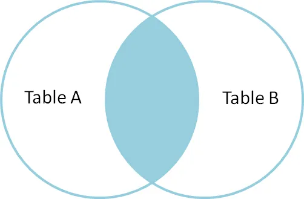
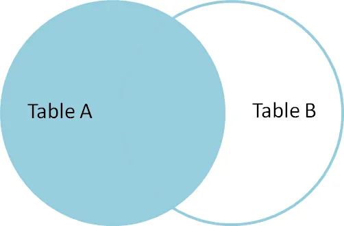
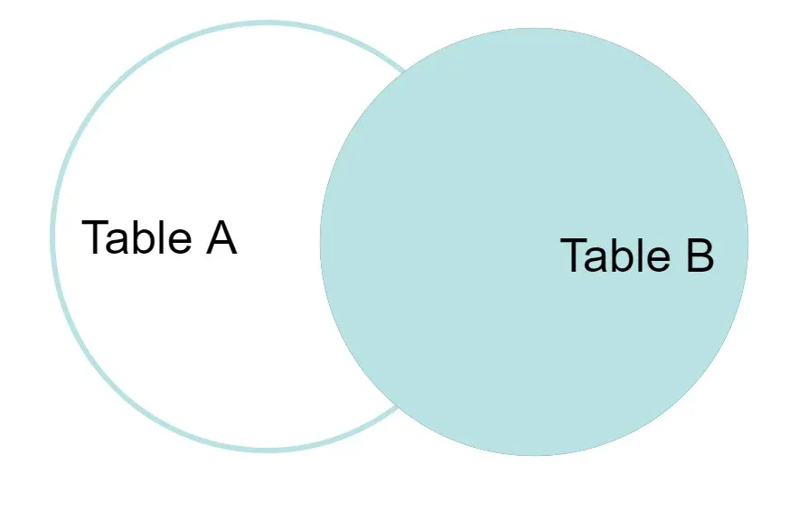

# Content
[Database](#Database) | [Table](#Table) | [WITH](#WITH) | [Fetch Ties](#Fetch-Ties) | [Arithmetic Operators](#Arithmetic-Operators) | 
[Wildcard Characters](#Wildcard-Characters) | [UPDATE Statement](#UPDATE-Statement) |  [ALTER TABLE](#ALTER-TABLE) | [CASE](#CASE) | 
[EXISTS](#EXISTS) | [DISTINCT](#DISTINCT) | [Aggregate Functions](#Aggregate-Functions) | [ORDER BY](#ORDER-BY) | [All ANY](#ALL-ANY)
[GROUP BY](#GROUP-BY) | [Joins](#Joins) | [Union](#Union) | [INTERSECT and EXCEPT](#INTERSECT-EXCEPT) | [CROSS SELF JOIN](#CROSS-SELF-JOIN) | 
[INNER LEFT RIGHT FULL JOIN](#INNER-LEFT-RIGHT-FULL-JOIN)

## Database

```sql
CREATE DATABASE database_name;
CREATE DATABASE IF NOT EXISTS database_name;
SHOW DATABASES;
USE database_name
DROP DATABASE GeeksForGeeks; --To delete an entire database and all of its associated tables
```
## Table

```sql
CREATE TABLE table_name (
    column1 datatype constraint,
    column2 datatype constraint,
   ....);   
CREATE TABLE IF NOT EXISTS table_name (
    column1 datatype constraint,
   ....);
   
SHOW TABLES;

DESCRIBE table_name;

DROP TABLE table_name; --To delete an entire table including its data and structure

TRUNCATE TABLE  table_name; --Removes all rows from a table but preserves the structure of the table for future use.

ALTER TABLE table_name ADD column_name datatype constraint;
ALTER TABLE table_name DROP COLUMN column_name;
ALTER TABLE table_name MODIFY COLUMN column_name datatype constraint;
ALTER TABLE table_name RENAME TO new_table_name;

CREATE TABLE Customer(
    CustomerID INT PRIMARY KEY,
    FirstName VARCHAR(50) NOT NULL,
    LastName VARCHAR(50),
    Country VARCHAR(50),
    Age INT CHECK (Age >= 0 AND Age <= 99),
    Phone int(10)
);

CREATE TABLE new_table_name AS
SELECT column1, column2, ...
FROM existing_table_name
WHERE ...;

CREATE TABLE SubTable AS
SELECT CustomerID, CustomerName
FROM customer;

SELECT CustomerName 
FROM Customer 
where Age = 21; 

SELECT Country, COUNT(*) AS customer_count
FROM Customer
GROUP BY Country;

SELECT DISTINCT Country
FROM Customer;

SELECT Country, COUNT(*) AS customer_count
FROM Customer
GROUP BY Country
HAVING COUNT(*) >= 2;

SELECT * FROM Customer ORDER BY Age DESC;   

SELECT * FROM Emp1 
WHERE Age BETWEEN 22 AND 24;

SELECT * 
FROM Employee 
WHERE Name LIKE 'L%';

SELECT Name FROM Emp1 WHERE Age IN (21,23);

DELETE FROM Employees
WHERE EmployeeID = 5;  

Since the DELETE statement is a DML operation, it can be rolled back when executed in a statement.
BEGIN TRANSACTION;
DELETE FROM GFG_Employees;
WHERE department = 'Development';

-- If needed, you can rollback the deletion
ROLLBACK;

NSERT INTO Customer (CustomerID, FirstName, LastName, Country, Age, Phone)
VALUES 
(1, 'Luca', 'Bianchi', 'Italy', 23, 'xxxxxxxxxx'),
(2, 'Aiko', 'Tanaka', 'Japan', 21, 'xxxxxxxxxx'),
(3, 'Carlos', 'Gomez', 'Spain', 24, 'xxxxxxxxxx'),

INSERT INTO Student 
VALUES (5, 'Isabella', 'Rome', 'xxxxxxxxxx', 19);

INSERT INTO Student
SELECT * FROM OldStudent;

INSERT INTO Student (Name, Age)
SELECT Name, Age
FROM OldStudent;

INSERT INTO Student
SELECT * FROM OldStudent
WHERE Age > 20;

SELECT * 
FROM Customers
WHERE NOT Country = 'UK';

SELECT * 
FROM Customers
WHERE NOT PostalCode IS NULL;

SELECT * 
FROM Customers
WHERE NOT Country = 'USA' AND NOT Country = 'UK';

```
## WITH
```sql

--CTE : Common Table Expression

WITH cte_name (column1, column2, ...)
AS (
    SELECT column1, column2, ...
    FROM table_name
    WHERE condition
)
SELECT *
FROM cte_name;

--Example 1: Finding Employees with Above-Average Salary

WITH AvgSalaryCTE (averageValue) AS (
    SELECT AVG(Salary)
    FROM Employees
)
SELECT 
    EmployeeID,
    Name, 
    Salary 
FROM 
    Employees 
WHERE 
    Salary > (SELECT averageValue FROM AvgSalaryCTE);
    
WITH MinSalaryCTE (min_salary) AS (
    -- 1. Calculate the single lowest salary value
    SELECT MIN(Salary)
    FROM Employees
)
SELECT 
    e.EmployeeID,
    e.Name, 
    e.Salary 
FROM 
    Employees e
WHERE 
    e.Salary = (SELECT min_salary FROM MinSalaryCTE);

```

## Fetch-Ties
```sql
SELECT * from myTable 
order by salary desc 
fetch first 3 rows only;

SELECT * from myTable 
order by salary desc 
fetch first 3 rows With Ties;

--We get the tied row in our output, only when we use the order by clause in our Select statement
```

## Arithmetic-Operators
```sql
SELECT employee_id, employee_name, salary, 
       salary + 100 AS "salary + 100"
FROM addition;

SELECT employee_id, employee_name, salary, 
       salary + employee_id AS "salary + employee_id"
FROM addition;

NULL means unknown/unavailable
It is not the same as 0 or empty string
Any operation with NULL results in NULL

```
## Wildcard-Characters

| Wildcard Character    | Description                                                                            | Example                                                                 |
|------------------------|----------------------------------------------------------------------------------------|-------------------------------------------------------------------------|
| `%`                   | Represents zero or more characters.                                                    | `SELECT * FROM employees WHERE name LIKE 'A%';` (matches names starting with A) |
| `_`                   | Represents exactly one character.                                                      | `SELECT * FROM employees WHERE name LIKE 'J_n';` (matches names like Jan, Jon) |
| `[ ]`                 | Represents a range of characters, used to match any single character within the range. | `SELECT * FROM products WHERE code LIKE '[A-C]%';` (matches codes starting with A, B, or C) |
| `[ ]` with `^` or `!` | Matches any character that is **NOT** in the specified range.                          | `SELECT * FROM products WHERE code LIKE '[^A-C]%';` (matches codes NOT starting with A, B, or C) |

## UPDATE-Statement
```sql
UPDATE Customer 
SET CustomerName = 'John', 
Country = 'Spain' 
WHERE CustomerID = 1;
```

##  ALTER-TABLE
```sql
ALTER TABLE table_name [ADD | DROP | MODIFY] column_name datatype;

ALTER TABLE table_name
RENAME COLUMN old_name TO new_name;

ALTER TABLE table_name
RENAME TO new_table_name;
```

## CASE
```sql
SELECT CustomerName, Age,
CASE
    WHEN Country = "India" THEN 'Indian'
    ELSE 'Foreign'
END AS Nationality --This will be column header
FROM Customer;
```
## EXISTS
```sql
SELECT Name
FROM Customers c
WHERE EXISTS (
    SELECT 1 --We don’t care about the actual columns from the subquery—we only need to check if at least one row exists
    FROM Orders o
    WHERE o.CustomerID = c.CustomerID
);
```

## DISTINCT
```sql
SELECT DISTINCT NAME FROM students;
SELECT DISTINCT AGE FROM students ORDER BY AGE;  
SELECT COUNT(DISTINCT ROLL_NO)  FROM Students ;
```

## Aggregate-Functions 
```sql
--COUNT
SELECT COUNT(*) AS TotalRecords FROM Employee;
SELECT COUNT(Salary) AS NonNullSalaries FROM Employee;
SELECT COUNT(DISTINCT Salary) AS UniqueSalaries FROM Employee;

--SUM
SELECT SUM(Salary) AS TotalSalary FROM Employee;
SELECT SUM(DISTINCT Salary) AS DistinctSalarySum FROM Employee;

--AVG
SELECT AVG(Salary) AS AverageSalary FROM Employee;
SELECT AVG(DISTINCT Salary) AS DistinctAvgSalary FROM Employee;

--MIN() and MAX()
SELECT MAX(Salary) AS HighestSalary FROM Employee;
SELECT MIN(Salary) AS LowestSalary FROM Employee;

```
## ORDER-BY
```sql
SELECT * FROM table_name ORDER BY column_name ASC | DESC; 

SELECT EmpID, Name, Department, Salary
FROM Employees
ORDER BY
 Salary DESC; 
 
SELECT * FROM students ORDER BY age DESC , name ASC; 

SELECT Roll_no, Name, Address
FROM studentinfo
ORDER BY 1 --By column number i.e. first column in this case
```

## GROUP-BY
```sql
SELECT Department, SUM(Salary) AS TotalSalary
FROM Employees
GROUP BY Department;

SELECT subject, year, COUNT(*)
FROM Student
GROUP BY subject, year;

SELECT NAME, SUM(sal) FROM Emp
GROUP BY name
HAVING SUM(sal)>50000; 

SELECT age, AVG(sal) AS Average_Salary
FROM emp
GROUP BY age
HAVING AVG(sal) > 60000;
```

## ALL-ANY
```sql
SELECT ProductName
FROM Products
WHERE ProductID = ALL (SELECT ProductID
                       FROM OrderDetails
                       WHERE Quantity = 6 OR Quantity = 2);
                       
SELECT * FROM Products
WHERE Price < ANY (SELECT Price FROM Products WHERE Price > 500);
```

## TOP
```sql
--Works with Microsoft SQL Server
SELECT TOP 2 * FROM Customer;

SELECT TOP 1 * FROM Customers
WHERE Country='Spain';

--For MySQL databases
SELECT column1,column2 
FROM table_name LIMIT value;

--For Oracle databases
SELECT column1,column2 
FROM table_name 
WHERE ROWNUM <= value;
```

## Joins
### Union
- **Removes Duplicate Rows:** The UNION clause ensures that only distinct rows are returned in the result set.
- **Includes Duplicates** with UNION ALL: The UNION ALL clause returns all rows, including duplicates.
- **Compatible Data:** The columns in each SELECT query must have the same number, order, and data type.
```sql
SELECT ROLL_NO FROM Students 
UNION 
SELECT ROLL_NO FROM Student_Details;  

SELECT ROLL_NO FROM Students 
UNION ALL 
SELECT ROLL_NO FROM Student_Details; 

SELECT ROLL_NO,NAME FROM Students WHERE ROLL_NO>3 
UNION ALL
SELECT ROLL_NO,Branch FROM Student_Details WHERE ROLL_NO<3
ORDER BY 1; 
```

### INTERSECT-EXCEPT 
- INTERSECT returns only the rows that are common to both queries. 
- EXCEPT returns the rows that are in the first query but not in the second.
```sql
SELECT column-1, column-2 …… 
FROM table 1
WHERE…..
INTERSECT
SELECT column-1, column-2 …… 
FROM table 2
WHERE…..

SELECT column-1, column-2 …… 
FROM table 1
WHERE…..
EXCEPT
SELECT column-1, column-2 …… 
FROM table 2
WHERE…..
```

### CROSS-SELF-JOIN
- A ```Cartesian``` Join or ```CROSS JOIN``` returns the Cartesian product of two tables, meaning each row from the first table is combined with every row from the second table.
- A ```Self Join``` is a join where a table is joined with itself
```sql
--CROSS JOIN
SELECT Student.NAME, Student.AGE, StudentCourse.COURSE_ID
FROM Student
CROSS JOIN StudentCourse; 

--SELF JOIN
SELECT a.ROLL_NO , b.NAME
FROM Student a, Student b
WHERE a.ROLL_NO < b.ROLL_NO;
```

### INNER-LEFT-RIGHT-FULL-JOIN
- ```INNER JOIN``` in SQL returns only the rows where there is a matching value in both tables. It combines records based on a related column and excludes non-matching rows

  
```sql
SELECT StudentCourse.COURSE_ID, Student.NAME, Student.AGE FROM Student
INNER JOIN StudentCourse
ON Student.ROLL_NO = StudentCourse.ROLL_NO;
```
- ```LEFT or LEFT OUTER JOIN``` returns all rows from the left table, along with matching rows from the right table. 
- If there is no match, NULL values are returned for columns from the right table.

  
```sql
SELECT Student.NAME,StudentCourse.COURSE_ID 
FROM Student
LEFT JOIN StudentCourse
ON StudentCourse.ROLL_NO = Student.ROLL_NO;
```
- ```RIGHT or RIGHT OUTER JOIN``` returns all the rows of the table on the right side of the join and matching rows for the table on the left side of the join. 
- If there is no matching row on the left side, the result-set will contain null.

  
```sql
SELECT Student.NAME,StudentCourse.COURSE_ID 
FROM Student
RIGHT JOIN StudentCourse 
ON StudentCourse.ROLL_NO = Student.ROLL_NO;
```
- ```FULL JOIN``` creates the result-set by combining results of both LEFT JOIN and RIGHT JOIN. The result-set will contain all the rows from both tables. 
- For the rows for which there is no matching, the result-set will contain NULL values.

  
```sql
SELECT Student.NAME,StudentCourse.COURSE_ID 
FROM Student
FULL JOIN StudentCourse 
ON StudentCourse.ROLL_NO = Student.ROLL_NO;
```
- ```NATURAL JOIN``` is a type of INNER JOIN that automatically joins two tables based on columns with the same name and data type. It returns only the rows where the values in the common columns match.
  - It returns rows where the values in these common columns are the same in both tables. 
  - Common columns appear only once in the result, even if they exist in both tables. 

  - Unlike a CROSS JOIN, which creates all possible combinations of rows, a Natural Join only includes rows with matching values
