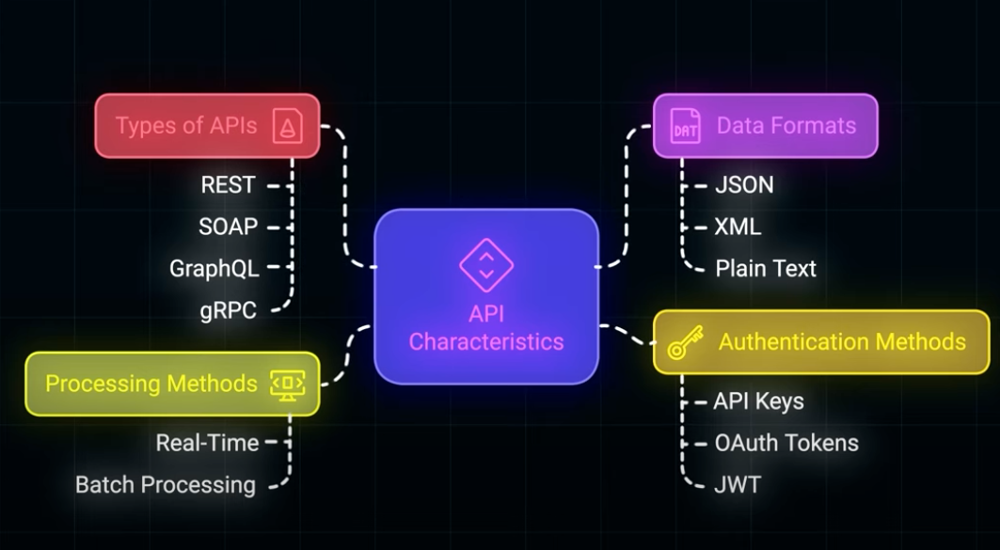

# Contents
[API Characteristics ](#API-Characteristics ) | [REST API](#REST-API) | [GraphQL](#GraphQL) | [gRPC](#gRPC) | [WebSocket](#WebSocket)

## API-Characteristics 

## REST-API
### Methods
1. GET
    - Read only to fetch the data
    - Idempotent, any no. of time same request will give same result
    - Use clear hierarchical end point
      - /user/{id}
      - /users
    - never include sensitive data in endpoint use them in headers or request body
    - Always return the right status code 
      - 200 OK: Found
      - 404: Not Found 
2. POST
    - Not Idempotent
    - Create resource
    - Validate the payload before sending
    - Document everything clearly like what is mandatory or optional
3. PUT
    - Full update
    - Idempotent
    - Make sure the request includes all the required fields
    - Do not use PUT for partial update
4. PATCH
    - For partial update, only a few fields
    - Not necessarily Idempotent
5. DELETE
    - Remove resource 
    - Idempotent
    - We should use soft delete
6. HEAD
    - lightweight version of GET 
    - Only returns headers and skip response body
      - It Can be useful in case we want to check if some resource exists or not 
      - Check what is file size before downloading
7. OPTIONS
   - used to get the available options on any API
   - it can be used in CORS(cross origin resource sharing)
     - Where browser asks what is the allowed method on any resource like USERS

### Best Practices
- Use HTTP method/verb correctly
- Use nouns for URI not action/verbs
- Use hierarchical URi
  - user/{id}/orders
- Use correct status code
  - ResponseEntity.CREATED
  - ResponseEntity.OK
  - ResponseEntity.NOT FOUND
- Some common codes
  - 200: OK
  - 201: Created
  - 204: No content: Success but no content to return
  - 400: Bad request
  - 401: Unauthorized: Authentication required
  - 403: Forbidden: Authenticated but no permission
  - 404: not found
  - 500: internal server error
- Proper error handling
- Proper validation
- Versioning
  - URI versioning 
    - /v1/user
    - /v2/user
  - Header versioning
    - 
- Pagination
- Filtering
- Sorting
- HATEOAS
- Security

### Caching 
1. In memory cache
2. Request level cache
3. Conditional cache
4. Cache invalidation

### IPC—Inter-Process Communication
1. RPI-Remote procedure invocation
   - Rest
   - gRPC
2. Messaging
