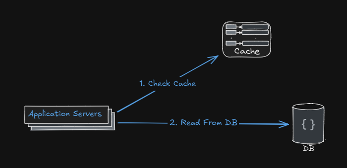
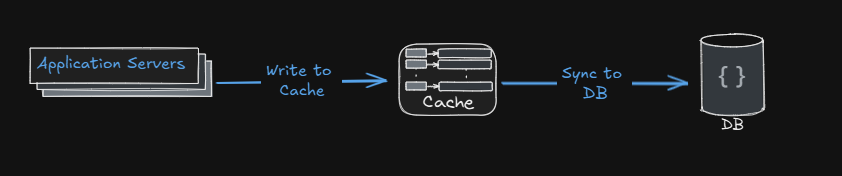
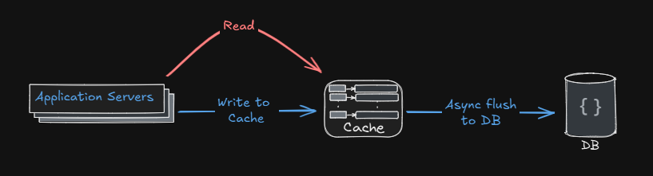
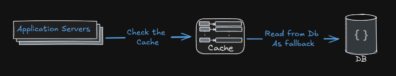

# Content
[Cache Implementation Strategies](#Cache-Implementation-Strategies) | [Cache Architecture](#Cache-Architecture) | 
[Cache Eviction Policies](#Cache-Eviction-Policies) | [Challanges](#Challanges)

## Cache-Implementation-Strategies
- **In-Memory Caching**: Storing frequently accessed data in the application’s memory for quick retrieval. Examples include using data structures like hash maps or specialized libraries like Ehcache or Caffeine.
- **Distributed Caching**: Using a distributed cache system like Redis or Memcached to store data across multiple servers, allowing for scalability and fault tolerance.
- **Database Caching**: Caching query results or frequently accessed data in a database to reduce load on the primary data source.
- **Content Delivery Networks (CDNs)**: Caching static assets like images, stylesheets, and scripts on geographically distributed servers to reduce latency for end-users.
- **Client-Side Caching**: Storing data on the client side (e.g., in the browser’s local storage or cookies) to reduce server requests and improve performance.

## Cache-Architecture
- **Cache Aside**: The application is responsible for loading data into the cache on demand. When data is requested, the application first checks the cache; if the data is not present, it retrieves it from the primary data source and stores it in the cache for future requests.

- **Write Through**: Data is written to both the cache and the primary data source simultaneously. This ensures that the cache is always up-to-date but may introduce latency during write operations.

- **Write Back/Behind**: Data is written to the cache first, and the cache asynchronously updates the primary data source at a later time. This can improve write performance but may lead to data inconsistency if not managed properly.

- **Read Through**: The cache automatically loads data from the primary data source when a cache miss occurs. This is often implemented using a caching library that handles the loading logic.

## Cache-Eviction-Policies
- **Least Recently Used (LRU)**: Evicts the least recently accessed items first.
- **First In First Out (FIFO)**: Evicts the oldest items in the cache first.
- **Least Frequently Used (LFU)**: Evicts items that are accessed the least frequently.
- **Time to Live (TTL)**: Evicts items after a specified time period has elapsed

## Challanges
- **Cache Stamping**: A situation where multiple requests for the same data result in multiple cache misses, leading to a surge in load on the primary data source.
- **Data Consistency**: Ensuring that the cached data remains consistent with the primary data source, especially in distributed systems.
- **Hot Key**: A scenario where a particular cache key is accessed very frequently, potentially leading to performance bottlenecks.