# Contents
[EDA](#EDA) | [Circuit Breaker](#Circuit-Breaker) | [Distributed Transaction](#Distributed-Transaction-ACID)
| [Strangler Pattern](#Strangler-Pattern) | [Database Per Service Pattern](#Database-Per-Service-Pattern)
| [Service Discovery](#Service-discovery) | [BFF](BFF) | [Aggregator Pattern](#Aggregator-Pattern)
| [Sidecar Pattern](#Sidecar-Pattern) | [CQRS](#CQRS) | [Event Sourcing](#Event-sourcing) | [Full-Request-Response-Lifecycle](#Full-Request-Response-Lifecycle)

## EDA
### Event Driven Architecture
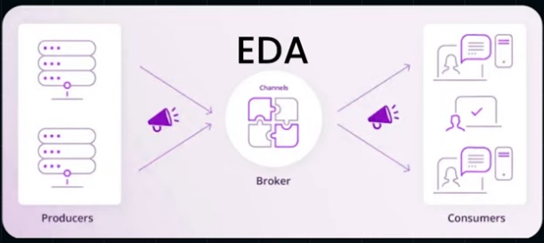
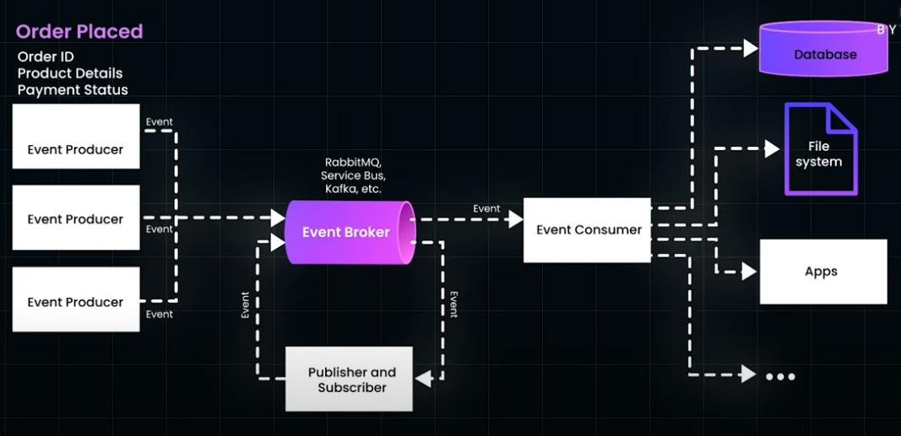

### Challenges
- Event ordering 
- event duplication in case of failure
- Data consistency

## Circuit-Breaker
1. helps to save a system with Cascading failures
   - Different state of CB
     - Closed States (Requests are flowing properly)
     - Open state (Failure rate exceeds a threshold)
     - Half-Open state (Failure reduced)
   - Providers
     - Hystrix 
     - Resilience4j

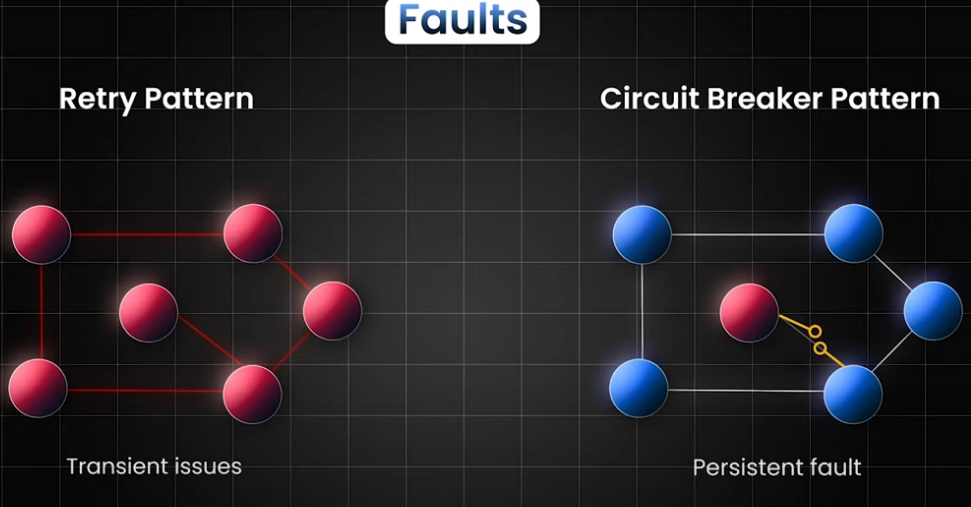

## Distributed-Transaction-ACID
1. 2PC
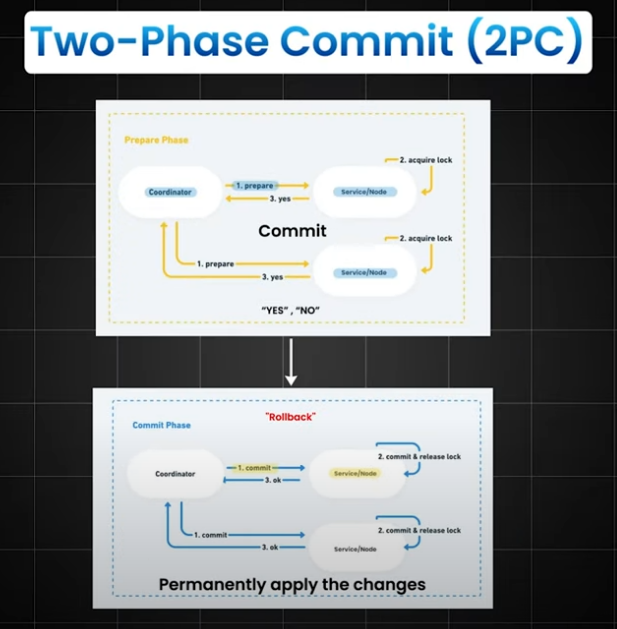
- Zookeeper (A good example of coordinator)
### Challenges
 - Performance
   - As additional communication and coordination needed.
 - Blocking 
   - Services become dependent on each other and coordinator.
 - Complexity
   - network communication, error handling and coordination between multiple services. 
### Read/Write to Disk
- The Coordinator does write the commit or abort message to disk before sending decision to other nodes, so in case it dies and recovers, it should know how to recover
- 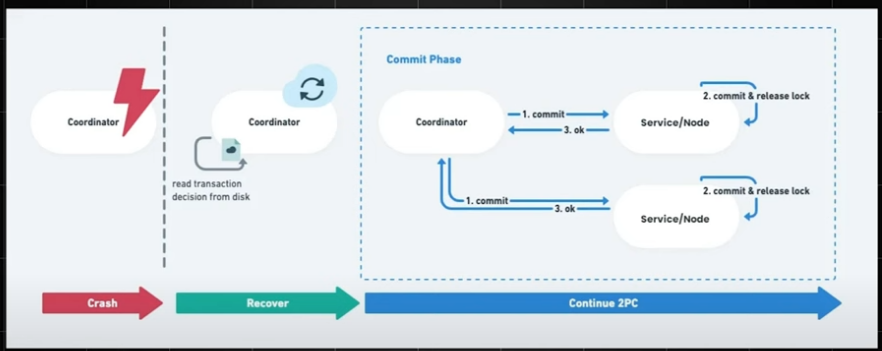
- In case it does not recover services needs manual intervention
- Google spanner does provide solution for this
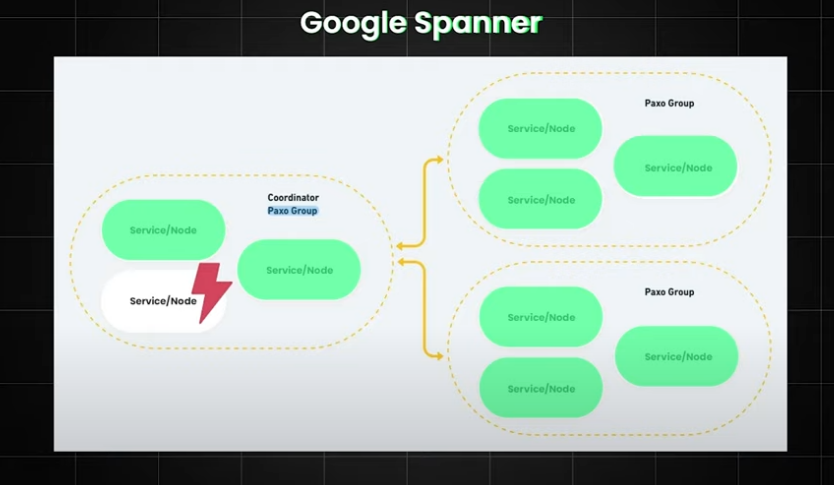

2. SAGAS

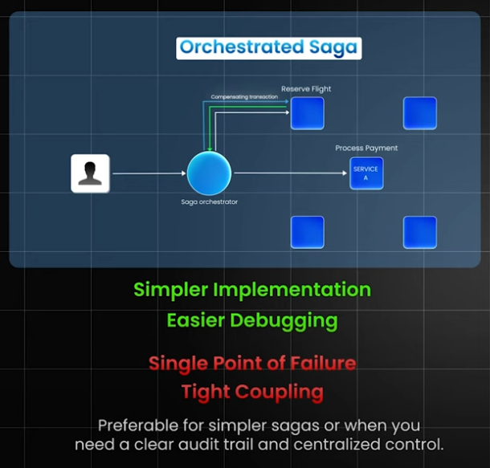
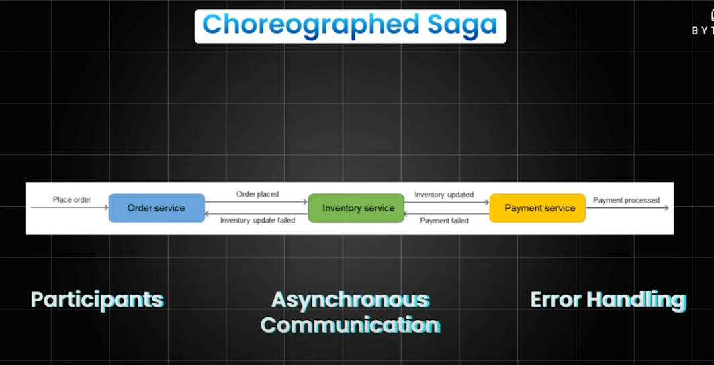
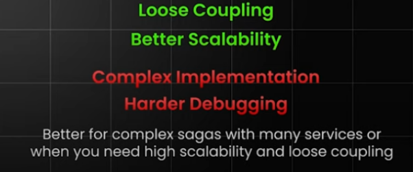

## Strangler-pattern
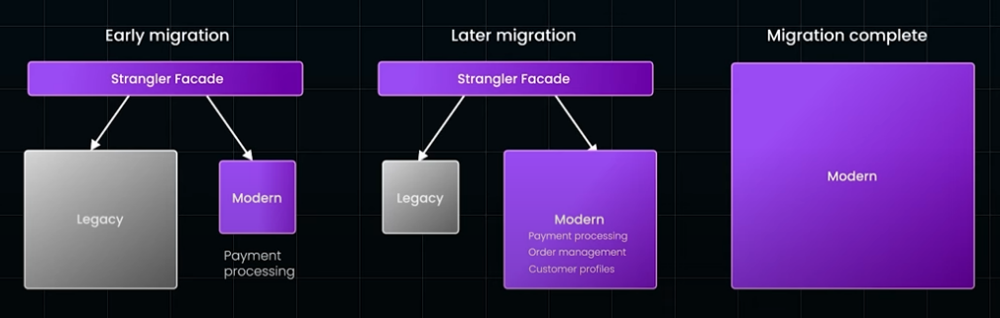

## Database Per Service Pattern
1. Private table per service
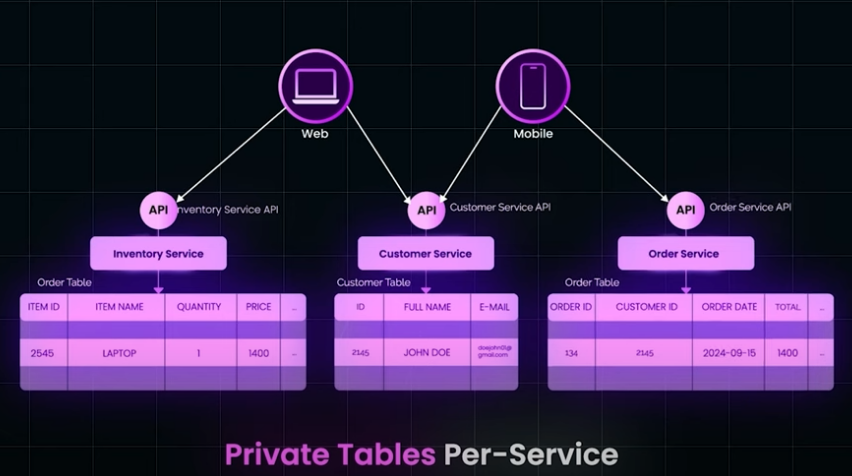
2. Schema per service
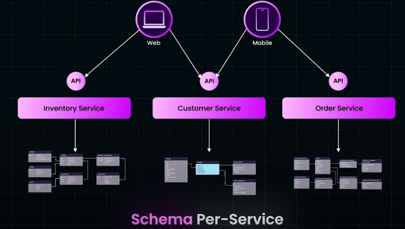
3. Database server per service
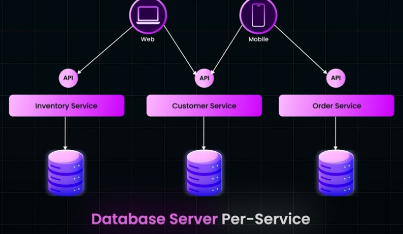
### Challenges
- Data consistency
- Data duplication
- cross-service queries are tricky 
- can be overcome with EDA

## Service-discovery
### Client side discovery
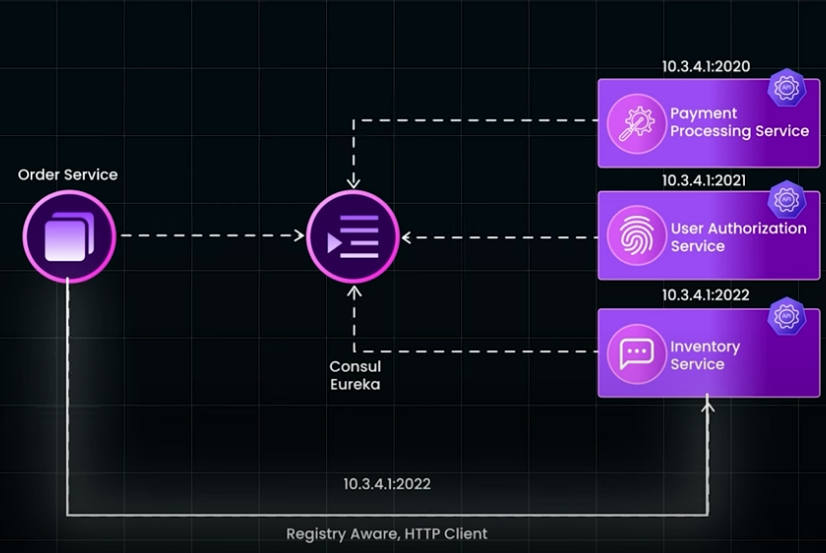
### Server side discovery
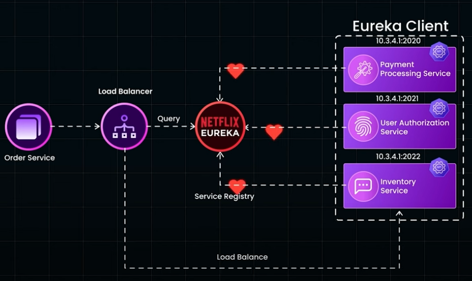
1. components of service discovery
- Service Registry
  - Eureka
  - Consul
  - Zookeeper
  - Kubernetes
  - CoreDNS
  - etcd
  - AWS cloud Map
- Health check
  - Only healthy services are kept in registry
- Load balancing
  - Distribute request evenly among available service instance
  
2. Steps to set up
- let's say we have two service Orders and User
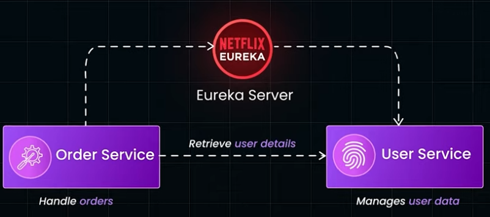
- EUREKA SERVER—In main class @EnableUrekaServer, now this app is eureka server
  - as this is a server, In property file set
    - server.port=8761 
    - eureka.client.register-with-eureka= false 
    - eureka.client.fetch-registry=false
- EUREKA CLIENT- in user service controller class @EnableEurekaClient will register user service with eureka server
  - In property file
    - server.port=8081
    - spring.application.name=user-service
    - eureka.client.service-url.defaultZone=http://localhost:8761/eureka/
- EUREKA CLIENT
  - in order service controller class 
    - @EnableEurekaClient will register order service with eureka server
    - @Autowired private RestTemplate restTemplate;
    - restTemplate.getForObject("http://user-service/users/")
    - @Bean 
      @LoadBalanced 
      public RestTemplate restTemplate(){
        return new RestTemplate();
      }
  - In property file
    - server.port=8082
    - spring.application.name=order-service
    - eureka.client.service-url.defaultZone=http://localhost:8761/eureka/
  
## BFF
- Backend for frontend 
- In a microservices architecture, we usually have multiple microservices, like:
  - User Service 
  - Product Service 
  - Order Service 
  - Payment Service 
- Now, different clients (web app, mobile app, third-party API) may need different responses and different data structures.
- If one single backend is serving all frontends, it often leads to:
  - Over-fetching data (getting more than needed)
  - Under-fetching data (not enough info)
  - Extra complexity in the frontend 
- BFF solves this problem
  - We create a separate backend layer for each frontend, which communicates with the microservices and sends optimized data for that specific client.

## Aggregator-Pattern
-  In microservices architecture when a single client request needs data from multiple microservices.
   Instead of calling multiple microservices directly from the client or UI, you introduce an aggregator service that:
   - Collects data from multiple services 
   - Combines or transforms it 
   - Returns a single, unified response to the client.
- Advantage
   - Avoid multiple calls from frontend → improve performance. 
   - Simplify frontend logic. 
   - Reduce network overhead. 
   - Provide optimized responses per client. 
### Types of Aggregator Patterns
1. Orchestration-based Aggregator ✅ (Most Common)
    - An aggregator service coordinates calls to multiple microservices. 
    - Can call them sequentially or in parallel. 
    - Combines results and returns a unified response.
2. Chained Aggregator 🔗 (Microservice-to-Microservice)
    - Instead of one aggregator, microservices call each other to build the final response. 
    - Suitable when data from one service depends on another. 
    - Example:
      - Order Service → gets order data. 
      - Then calls Payment Service → to get payment status. 
      - Then calls Shipping Service → to get tracking info.
3. Event-driven Aggregator
      - Uses message brokers like Kafka, RabbitMQ, or AWS SNS/SQS. 
      - Instead of making synchronous REST calls, aggregator subscribes to events and combines results asynchronously. 
      - Example:
        - Order Service publishes an OrderCreated event. 
        - Payment Service publishes PaymentCompleted. 
        - Shipping Service publishes ShipmentDispatched. 
        - Aggregator Service listens to all events and builds a complete order status asynchronously.
## Sidecar-Pattern
- The Sidecar Pattern is a design pattern in microservices architecture where an auxiliary process (sidecar) runs alongside a primary microservice in the same container, VM, or pod. 
- The main microservice focuses on business logic. 
- The sidecar handles cross-cutting concerns like:
  - Service discovery 
  - Logging & monitoring 
  - Security & authentication 
  - Proxying & routing 
  - Configuration management
## CQRS
- CQRS stands for Command Query Responsibility Segregation.
- It is a design pattern where we separate:
  - Commands → Operations that change data (Create, Update, Delete). 
  - Queries → Operations that read data (Get, List, Search).
- With One DB

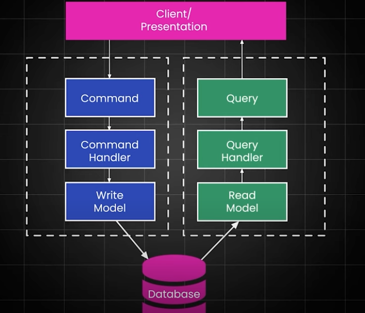
- With 2 diff DB

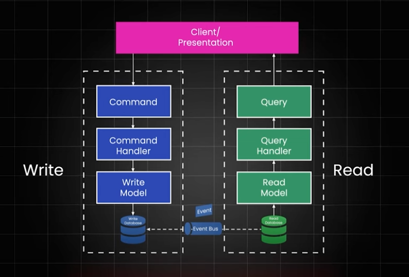
- Advantages of CQRS 
    - Performance → Optimize read and write separately. 
    - Scalability → Scale read services independently. 
    - Security → Different models for read and write = better control. 
    - Flexibility → Read DB can be SQL, NoSQL, Elasticsearch, etc. 
    - Event-driven support → Works perfectly with Kafka/RabbitMQ.
- Disadvantages of CQRS 
    - Complexity → More moving parts: command, query, events. 
    - Eventual Consistency → Reads might lag slightly after writes. 
    - Infrastructure Cost → Maintaining separate databases. 
    - Debugging Harder → Two systems to monitor instead of one.
      Event Sourcing
## Event-sourcing
- event sourcing best suited with CQRS
- Instead of storing only the final state, we store every business event. 
- Example: OrderCreated, PaymentProcessed, InventoryReserved. 
- These events are stored in the Event Store and published to Kafka/RabbitMQ. 
- Benefits:
  - Auditability → full event history available. 
  - Replayability → rebuild state anytime. 
  - Loose coupling → other services subscribe to events.

